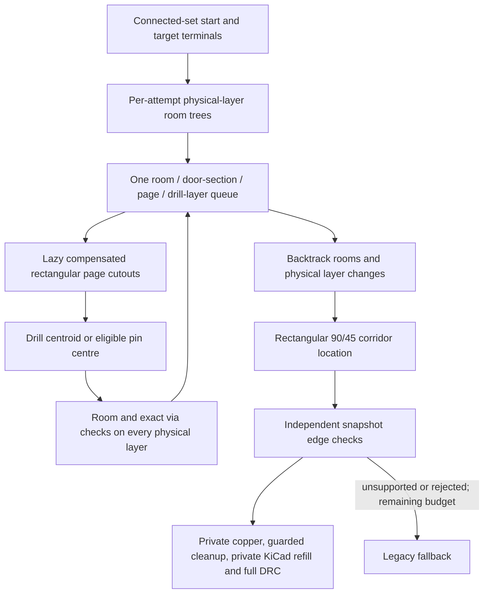

# Active rectangular room/drill search — parity slice, 2026-09-08

**Not feature parity.** This pass moves default multilayer search from a
standalone grid/visibility proposal to an active room/page/drill-layer frontier
first. It does not replace the full Freerouting geometric, insertion, fanout,
shove or optimization engines. Read the complete remaining scope in
[PARITY-CLOSURE-CHECKLIST.md](PARITY-CLOSURE-CHECKLIST.md).

Source behavior is pinned to `a11c0a42d1b3827e5126429c5c9820c4ab5bec7c`.
Quality/performance measurements use the official **Freerouting v2.3.0** JAR,
`2d4de019aa89e9fa3dc1dc44e09bf509760cafc1`. They are deliberately different
baselines. The protected reference checkout is read-only and unchanged.
Java is used only by QA; production routing stays native, with no JVM,
DSN/SES handoff, network router or reference GUI.

## What is actually running now

1. **Lazy free drill regions, not landmarks.** `IntBox::Cutout` ports the four
   source pieces and perimeter-minimizing strict comparisons; the rectangular
   `PolylineArea::SplitToConvex` removes holes sequentially in source order.
   Degenerate cutout pieces are retained by cutout and filtered by decomposition.
   Page overlap requires area, not point/edge contact. Page queries traverse the
   source row-major bounding range instead of scanning the entire board.
2. **Separate geometry and maze lifetimes.** Drill pages cache by net, physical
   layer count and SMD-attachment policy. Reset clears occupation; invalidation
   discards geometry. Immediate-previous-obstacle containment suppression,
   Java-compatible negative-half rounding and 32-bit IDs are explicit.
3. **Room/page/drill/layer expansion.** A shared `RoomSearchContext` manages the
   existing orthogonal room lifecycle on every physical layer, with unique room
   IDs across the stack. One queue handles room doors, lazy pages, drill entering
   sections and drill exits. Pages are not occupied as physical doors; drill
   backtracking skips the page. Normal via cost is charged once in expansion g.
   Inactive trace layers still participate in drill-room/clearance checks.
4. **Physical through drills.** Every candidate must have a room and pass exact
   snapshot via checks across the manufactured stack, not merely trace entry/exit
   layers. Worker via obstacles occupy that same full stack. SMD attachment is
   wired to the source-style last eligible strictly-interior top pin, otherwise
   bottom pin; disabled attachment excludes those pad regions. Allowed attachment
   supplies candidates—it does not force the search to use a pin.
5. **Backtracking and validation.** Rectangular 90/45-degree corridors are composed
   with colocated layer transitions at the actual drill centroid/pin location.
   Queue entry points are not mistaken for physical drill locations. The host
   adapter independently checks every returned edge. Unsupported or rejected
   proposals retain the legacy fallback, sharing the work limit/cancellation.
6. **Generated-copper cleanup.** Exact same-net centre-line junction queries now
   support trimming trace tails and overlapping ends back to their useful
   junctions. Trimming restores the original route if any real pad/plane contact
   group would be lost. Original host copper is never a deletion candidate here.
   This handles a trace spanning an interior via/T junction without deleting
   its useful trunk. It is not full normal-contact/trace normalization.
7. **Bounded allocation.** The wrapper's eager, unused second drill grid was
   removed. It could allocate millions of pages even on a cancelled/no-via job.
   The active frontier checks page count against the work budget before allocating;
   page dimensions/arithmetic, decomposition pieces and queue state storage are
   also checked. Resource failure is explicit, never truncated free space.



The native file mapping is in [UPSTREAM.md](UPSTREAM.md). The previous no-via
milestone and its immutable results remain in [ROOM-DOOR-SEARCH.md](ROOM-DOOR-SEARCH.md).

## Reference proof, not self-generated expected answers

`DrillSearchOracle.java` executes the pinned Java implementation itself:

- 256 `IntBox.cutout` records, including piece order;
- 256 `PolylineArea.splitToConvex` records, with all rectangles and centroid IDs;
- 256 `DrillPageArray` records, with all page shapes/IDs and overlap order;
- 256 actual `MazeExpansionEngine.expandToDrillPage` queue-cost records;
- 256 actual `expandToDrill` queue-cost/entry/ID records, both page and non-page parents.

The **1,280-record** fixture SHA-256 is
`3d4b67cd5ab70a7f42fb76688263b9457102dcb52ebe0a87867bf65d01150907`.
It is regenerated outside the reference checkout and compared byte-for-byte.
Only the known timestamped degenerate-hole warning is normalized; raw output is
retained, each record family must be complete, and unexpected diagnostics fail.
The preceding 7,166-record room oracle still regenerates identically.

These are primitive differential tests, **not** proof of end-to-end search-stream
parity. Cost records isolate the expansion operation by supplying the actual
reference destination estimate. The native whole-search heuristic is still a
substitute, so matching these costs must not be presented as heuristic parity.

## Validation

- Native autorouter: **68 cases / 199,251 assertions passed**.
- Native + DRC + zone tests: **302 cases / 201,424 assertions passed**.
- Python harness/oracle tests: **21 passed**.
- ASan + UBSan: **600 data-only multilayer cycles**, comprising 400 routed paths
  and 200 blocked physical stacks. Independent segment/rectangle clipping checks
  all paths, angle constraints, owner endpoints and colocated layer transitions.
  Leak detection was disabled; this is not full-host sanitization or a peak-memory
  benchmark.
- Regression cases cover required one-via and two-via paths, a completely empty
  alternate layer, disabled intermediate layers, SMD attachment policy, blocked
  drilling, cache reset/invalidation, work/cancellation limits, oversized arrays,
  interior-via tails and doubled/overlapping trace ends.
- Full PCB suite: **2,392 / 2,393 cases passed** (including 18 warning cases);
  **387,661 / 387,663 assertions passed**. The final authoritative log is
  `logs/full-pcb-final.log`. It is **not green**: the existing order-dependent
  `MatchProperties/KeysAreCanonicalAndLabelsAreFriendly` label assertions still
  fail. Native + MatchProperties in isolation passes **94 cases / 199,424
  assertions**. The full-suite failures are not waived or changed by this work.
- The native PCB module and QA executables were rebuilt. This pass did **not**
  restart the user's editor or validate GUI review/accept/undo behavior.

Two pre-existing tests assumed a particular legacy routing shape. The off-grid
obstacle test now blocks every enabled layer so it really requires a detour
instead of forbidding a legal one-segment route on another layer. The fanout
regression checks retained work, real connectivity, no dangling endpoints and
zero unused vias rather than requiring one arbitrary surviving stub. No safety
or completion assertion was weakened.

## Repeated same-board comparison

All figures below are **native / reference**; lengths and core times are medians
of three runs. Missing connections and violations are measured by KiCad after
refill, not inferred from worker task counts or the reference statistics shortcut.
A timeout has no invented native PCB, completion or quality score.

| Mode | Local board | Missing | New KiCad DRC | Vias | Track length mm | Core ms | Strict gate |
|---|---|---:|---:|---:|---:|---:|---|
| default | regulated-5v | 0 / 0 | 0 / 0 | 0 / 0 | 323.211 / 319.203 | 1710 / 370.0 | PASS (small-board gate only) |
| default | 555-astable | 0 / 0 | 0 / 10 | 11 / 7 | 96.180 / 184.248 | 35 / 2000.0 | FAIL: +4 vias |
| default | bjt-astable | 0 / 0 | 0 / 0 | 0 / 0 | 145.458 / 152.435 | 19 / 270.0 | PASS (small-board gate only) |
| no-vias | regulated-5v | 0 / 0 | 0 / 0 | 0 / 0 | 357.391 / 319.203 | 397 / 390.0 | FAIL: length > +10% |
| no-vias | 555-astable | timeout / 0 | timeout / 1 | timeout / 0 | — / 193.479 | >180,000 wall / 1040.0 | FAIL: native timeout |
| no-vias | bjt-astable | 0 / 0 | 0 / 0 | 0 / 0 | 147.318 / 152.435 | 16 / 270.0 | PASS (small-board gate only) |

Conditions: identical normalized stripped input per pair, original placements,
zones and rules retained; four routing passes, eight native retry attempts,
250,000 native expansion limit, optimization disabled in both engines, one
reference thread, 180-second **per-process** cap. No-via cases disable both vias
and fanout in both engines. Debug logs are on in both native modes. Engine core
clock, host validation/copy/refill time and process wall time remain distinct.
Native UI cost/heuristic mapping is not yet reference-equivalent; these are
controlled same-input smoke gates, not identical search-settings/ordering proof.

The default 555 previously used 10 vias; this milestone uses 11 versus the
reference's 7. Its strict quality gate therefore remains failed and the one-via
regression versus the preceding native milestone is explicit. Lower routing time
or shorter traces does not waive that gate. No new native DRC is tolerated even
when the reference has violations. General fanout and via optimization are still
required; do not label this board a parity pass.

Speed is not uniformly improved: default regulator routing takes **1,710 ms**
versus **370 ms** in the reference and **1,025 ms** in the preceding native
milestone. Its log identifies a rejected rectangular proposal followed by one
**1,631 ms** legacy fallback search as the dominant operation in repeat 1.
This is an explicit performance regression, not a drill-performance success.

Earlier trials are retained too. The first multilayer trial introduced a
KiCad dangling-track marker despite zero missing connections. The offending
trace extended past a junction inside a collinear trace. Geometry contact alone
was insufficient: trimming its doubled end back to the exact junction removed
the marker. The private host-validation gate rejected the earlier result; it
was not accepted into the user's board.

## Deliberate adaptations and remaining blockers

- **Rectangles only:** native obstacles are conservatively compensated bounding
  rectangles, not exact source 45/general convex shapes. They can close valid
  narrow/diagonal channels. Pad/trace terminals and plane regions are still partial.
- **Search estimate/costs:** reference-weighted Euclidean distance and page/drill g/f
  primitives are ported, but the component/solder/inner-box destination calculation,
  exact per-layer costs, target identity, pin exit geometry, thin-room adjustment
  and full decision ordering are not. The minimum-trace-cost geometric estimate
  is not a proof of globally optimal or source-identical search decisions. Legacy
  batch scoring remains in legacy units and is not mixed into the new frontier.
- **Empty-layer adaptation:** source normally reaches another page through a room
  door, not directly from a drill exit. Our rectangular representation of a wholly
  empty layer has no such door. It permits page expansion from a drill exit only
  in that doorless case, with per-drill/layer occupation preventing cycles. This
  avoids stranding a valid two-via crossing and is explicitly not identical source
  control flow.
- **Via scope:** one manufactured through-hole padstack; no blind/buried/microvia
  masks, multiple alternative via rules, forced pad shove, or existing-via rip-up
  expansion. Caches are attempt-local; tested reset/invalidate APIs are not yet
  persistent incremental cross-net database maintenance.
- **Copper normalization:** exact integer centre-line junctions and guarded
  endpoint cleanup are implemented, not general rational/contact splitting,
  full chain removal or trace tightening. Near/off-line contacts may be retained
  rather than guessed. All accepted outputs still require full KiCad validation.
- **Major engines still missing:** forced trace/via insertion with speculative
  rollback, recursive shove/spring-over/neckdown, reference fanout and batch/rip-up
  scheduling, and reference pull-tight/via optimization. The legacy fallback
  cannot substitute for those engines.
- **Repair ownership remains open:** post-refill snapshots freeze previous
  job-generated copper together with original copper. The known no-via 555 repair
  failure is not declared fixed by this drill work. Preserve original/job ownership
  and mutable contacts before implementing safe repair rip-up—do not enable blanket
  existing-copper deletion.

## Reproduction and durable evidence

From the native repository (never the protected reference checkout):

```sh
/opt/homebrew/bin/cmake --build build/autorouter --target qa_pcbnew qa_autorouter_parity -j 6
build/autorouter/qa/tests/pcbnew/qa_pcbnew --run_test=NativeAutorouter --report_level=short
python3 -m unittest discover -s scripts/autorouter -p 'test_*.py'
python3 scripts/autorouter/run_room_oracle.py --oracle drill \
  --reference-jar /tmp/freerouting-reference/build/libs/freerouting-current-executable.jar \
  --java /opt/homebrew/opt/openjdk@25/bin/java --javac /opt/homebrew/opt/openjdk@25/bin/javac \
  --output-dir build/autorouter/new-drill-oracle-run
```

Working evidence: `build/autorouter/drill-parity/`. Durable local archive:
`autorouter-test-assets/online-simple/drill-search-2026-09-08/`.
It contains the final pairs, saved normalized/reference/native boards where
available, independent reload checks, raw failing trials, build/test/oracle logs,
exact driver/sanitizer scripts, binary/JAR/source identities, the entire dirty
native-tree patch, and a verified file-hash manifest. Earlier archives and original
boards are unchanged. Third-party assets remain local/Git-ignored; original online
sources and licensing notes are preserved with them.
