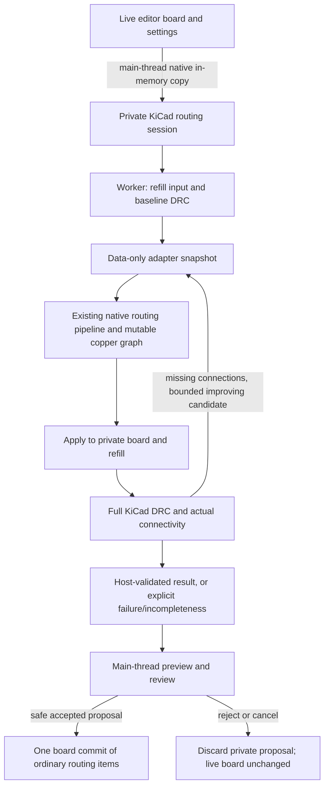

# Freerouting parity: complete acceptance checklist and current status

**Status: NOT at core algorithm parity.** Passing three small boards is a smoke
gate, not the MVP acceptance gate. This document supersedes older descriptions
that call similarly named classes a completed port. It records the entire core
routing acceptance scope, not a percentage based on file counts.

Reference source: `a11c0a42d1b3827e5126429c5c9820c4ab5bec7c`.
Repeatable quality/performance baseline: official Freerouting **v2.3.0**,
`2d4de019aa89e9fa3dc1dc44e09bf509760cafc1`.
The development source and release baseline are different revisions; match
algorithm decisions against the former and measure release quality against the
latter. Never modify the protected reference checkout or build inside it.

## Latest core milestone — layer-local padstack and pin-entry semantics

The KiCad snapshot now retains, for every routable pad layer, stable indices
to all exact copper contours that form that padstack shape.  A custom pad with
several outlines is no longer represented at the pad-model boundary by only
one maximum radius and one axis-aligned box; the existing exact circle,
capsule, rectangle and polygon obstacle records are explicitly associated with
their physical pad layer.  This closes the data dependency needed by later
item-specific clearance and mutation work without duplicating live `PAD`
objects on the routing thread.

`Padstack.getTraceExitDirections()` and the relevant
`Pin.getTraceExitRestrictions()` semantics are also translated.  Rectangular
Specctra padstack shapes retain source-ordered RIGHT/LEFT/UP/DOWN restrictions,
the 1.5 aspect-ratio threshold and the source's doubled threshold for packages
with at most three pins.  Directions use normalized integral vectors after the
complete KiCad pad orientation, and each restriction carries the measured
pin-centre-to-border length, including pad offsets.  Oval, rounded, chamfered,
trapezoidal and custom shapes correctly remain unrestricted because KiCad
exports them as Specctra paths/polygons rather than `IntBox`/`IntOctagon`.

All three multilayer room frontiers now preserve the source pin as the
`backtrackDoor` only when a drill page is reached directly from its target-item
door.  Drill expansion then uses `Pin.nearestTraceExitCorner()` rather than the
unrestricted room-entry point, including the source default
pin-edge-to-turn gap and compensated trace half-width.  The pointer is cleared
after intervening room/door travel, so unrelated drills cannot inherit stale
package restrictions.  Post-routing `PolylineTrace.correctConnectionToPin()`
and its shove-fixed exit stub remain open.

This checkpoint passes **233/233 native autorouter cases** and all **26 Python
parity-harness tests**.  Both KiCad test/build targets link successfully.  The
BJT A/B gate remains 16/16 with 146.150 mm of track, zero vias and zero new
KiCad DRC violations.  The stripped 555 gate remains 12/12 with 87.912 mm of
track, 12 vias and zero new native DRC violations; its paired quality gate is
still intentionally red because the pinned reference uses seven vias but
introduces ten KiCad DRC violations.  Layer-shaped *via* padstacks and complete
contextual clearance classes remain open.

## Previous core milestone — exact rational contact preservation

The contact kernel now carries Freerouting `Point` values through segment
containment, polyline containment and normal-contact queries without first
requiring an integral KiCad coordinate.  Closed-segment intersection has an
exact `RationalPoint` result and retains arbitrary-precision homogeneous
coordinates; the older host adapter still returns an integral point only when
the exact denominator is one.  It never rounds a half-IU crossing into false
copper topology.

The detached routing board now records a non-integral same-net trace crossing
as a symmetric exact normal contact.  This preserves electrical connected-set
semantics and the source contact point across nested worker transactions,
route removal and rollback.  Because KiCad trace vertices are integral, the
two host-emission polylines remain unsplit and connection-chain traversal stops
at that virtual interior fork.  Integral crossings continue through the full
source split/cycle/combine lifecycle with stable item identity.  This explicit
host boundary is safer and more faithful than either dropping the rational
contact or manufacturing a rounded junction; exact non-integral piece
materialization remains open.

This checkpoint passes **231/231 native autorouter cases**, including focused
rational intersection/contact/rollback regressions, and all **26 Python
parity-harness tests**.  Both KiCad test/build targets link successfully.  The
BJT A/B gate remains 16/16 with 146.150 mm of track, zero vias and zero new
KiCad DRC violations.  The stripped 555 gate remains 12/12 with 87.912 mm of
track, 12 vias and zero new native DRC violations; its paired quality gate is
still intentionally red because the pinned reference uses seven vias but
introduces ten KiCad DRC violations.

## Previous core milestone — legacy orthogonal multilayer shove lifecycle

The retained rectangular multilayer frontier now carries the same source
`MazeSearchElement` trace-room state as the active exact-octagonal and
unrestricted-angle engines.  Every room, drill and target state preserves the
paid obstacle group, `roomRipped`, LEFT/RIGHT adjustment and one-time
`alreadyChecked` marker.  A movable source trace is first probed through
`MazeTraceShover` from an outer compensated door section; proven same-side
doors enter the queue at zero rip-up cost, while an incomplete shove requeues
the exact entry once with its source item cost.  Consecutive shapes of one item
retain the source's cost-one continuation instead of paying the full group
again.

Backtracking now attributes cost to the exact state that paid it and realizes
source-width trace corridors through the octagonal locator, including strict
orthogonal output when requested.  Complete-centre fanout/plane callers retain
the legacy rectangular locator.  The production caller also propagates the
same source-trace-room mode into this compatibility frontier, so selecting it
cannot silently fall back to immediate conventional rip-up.

This checkpoint passes **229/229 native autorouter cases** and all **26 Python
parity-harness tests**.  Both KiCad test/build targets link successfully.  The
BJT A/B gate remains 16/16 with 146.150 mm of track, zero vias and zero new
KiCad DRC violations.  The stripped 555 gate remains 12/12 with 87.912 mm of
track, 12 vias and zero new native DRC violations; its paired quality gate is
still intentionally red because the pinned reference uses seven vias but
introduces ten KiCad DRC violations.

## Previous core milestone — fixed-state trace normalization

The detached board now carries Freerouting's ordered `FixedState` semantics
(`UNFIXED`, `SHOVE_FIXED`, `USER_FIXED`, `SYSTEM_FIXED`) independently from
KiCad host replacement policy.  Fixed state is retained per trace edge and per
worker item, participates in source `PolylineTrace` identity, and prevents a
same-width/same-clearance run from being collapsed across a state boundary.
`USER_FIXED` and `SYSTEM_FIXED` traces reject splitting and combination because
their deletion is forbidden.  `SHOVE_FIXED` traces remain routable and may be
split/recombined with only the same state and manufacturing style, while their
state remains available to the fanout-via protection test.  This replaces the
former inaccurate inference that every non-dynamic/non-routable straight trace
was a shove-fixed pin exit.

Retained straight host traces now have exact private route geometry and style,
so permitted virtual split/combine operations preserve UUID provenance without
materializing or editing the live KiCad item.  Ordinary pre-existing KiCad
copper maps to protected `USER_FIXED`, a locked item maps to `SYSTEM_FIXED`,
and copper created by an earlier stage of the same autorouter job maps to
`UNFIXED`.  The independent `isMovable` flag continues to control the explicit
whole-net replacement/shove transaction; selecting that host policy can no
longer silently alter source contact normalization.

This checkpoint passes **228/228 native autorouter cases**, both focused
fixed-state/rollback regressions, and all **26 Python parity-harness tests**.
The BJT A/B gate remains 16/16 with 146.150 mm of track, zero vias, and zero
new KiCad DRC violations.  Exact rational/non-integral junction topology,
component-owned deletion semantics, curved trace items and state-preserving
general shove/change operations remain open.

## Previous core milestone — finite conduction targets and connection stop options

`ConductionArea.getTraceConnectionShape()` is now represented as one finite
filled target item rather than a list of sampled synthetic pad coordinates.
The detached worker retains the exact rectangle or polygon plus its holes,
associates it with one stable host plane terminal, and carries it through the
orthogonal, 45-degree and unrestricted-angle single- and multilayer room
frontiers. Target-door attachment intersects that filled region with the exact
reached `IntBox`, `IntOctagon`, or rational `Simplex`, shrinks the complete
region by the physical trace radius, and then selects a checked integral KiCad
point. Polygon deflation occurs before convex decomposition, so internal
triangulation diagonals cannot create false clearance margins. Ordinary plane
routing now searches from the selected item's complete connected set toward
the complete dynamic unconnected item set, matching
`AutorouteConnectionRouter` instead of routing to one adapter sample.

The complete `Item.StopConnectionOption` surface is active as well.
`getConnectionItems(NONE/FANOUT_VIA/VIA)` may start at a non-routable terminal,
walks the same unique normal-contact chain, stops before the requested drill,
and recognizes source fanout vias through direct single-layer pins, protected
short pin traces, and representable fixed two-corner exits. The explicit native
fanout route marker remains a host adapter fallback after the physical source
tests. These options are now available for subsequent exact rip-up and tail
removal work rather than being collapsed to `NONE`.

This checkpoint passes **227/227 native autorouter cases** and all **26 Python
parity-harness tests**. The BJT A/B gate remains 16/16 with 146.150 mm of track,
zero vias, and zero new KiCad DRC violations. The stripped 555 gate remains
12/12 and host-valid with 87.912 mm of track, 12 vias, and zero new KiCad DRC
violations; its paired gate is intentionally red because the pinned reference
output introduces ten KiCad DRC violations. Dynamic plane void/split modelling,
reference-equivalent plane via optimization, rational/curved trace contacts,
and fixed host-item normalization remain open.

## Previous core milestone — source connection/cycle normalization lifecycle

The worker board now also ports the pinned `PolylineTrace.split`,
`PolylineTrace.combine`, `PolylineTrace.isCycle`,
`PolylineTraceNormalization.normalize`, and `BasicBoard.removeIfCycle`
mutation order for the exact integral subset which KiCad can materialize.
Same-net crossings and collinear overlap boundaries split both traces while
preserving the first native item identity; normal-contact-at-point queries keep
the source distinction from `normalContactPoint`, so two coincident traces are
visible at both endpoints even though they do not have one unique contact
point. Found split pieces are cycle-tested before the newly inserted pieces,
then each survivor repeatedly combines at its start before its end. Combination
requires the source-compatible layer, net, width, clearance and mutable fixed
state, ignores conduction areas when counting the one allowed endpoint contact,
updates the item search index incrementally, and exposes a shared normalized
item to optimizer enumeration only once.

KiCad's proposal layer still retains host insertion records. When source-style
combination makes several records aliases of one `PolylineTrace`, removal now
rebuilds only the transitive alias cluster from the surviving requests inside
the same worker transaction; unrelated item identities and index entries remain
stable, and rollback restores the exact pre-edit graph. The optimizer selects
the combined item-local geometry only for such an alias, retaining the complete
compound route for ordinary trace/via and fanout records.

`Item.getConnectionItems()`, `BasicBoard.getTraceTail()` and the complete
`BasicBoard.removeIfCycle()` lifecycle are now active in normalization as well.
Connection traversal follows unique normal-contact points through mutable
trace/via items until a fork, stub, layer transition ambiguity, repeated item,
or non-routable terminal; cycle deletion removes that complete item connection
and then removes only endpoint tails manufactured by the deletion. Every such
edit remains inside the worker transaction, including exact item IDs and
topology on rollback. Optimizer endpoint/tail probes now use a full occupancy
transaction rather than attempting an inverse remove/add operation; this is
necessary because source normalization is intentionally non-invertible when
coincident host insertion records alias the same normalized trace.

This checkpoint passes **225/225 native autorouter cases** and all **26 Python parity-harness
tests**. The BJT A/B gate remains 16/16 with zero new KiCad DRC violations; the
stripped 555 gate remains 12/12 with zero native DRC violations and is red only
because the pinned reference output introduces ten KiCad DRC violations.
Rational, non-integral trace junction materialization and fixed host-item
normalization remain explicit open parts of the mutable-board phase. The
stop-option/fanout-via variants listed at this earlier checkpoint were completed
by the following milestone above.

## Previous core milestone — unrestricted-angle source geometry and shove lifecycle

The active unrestricted-angle single-layer frontier now uses Freerouting's
source obstacle-side compensation model instead of the former native shortcut
which inflated obstacles by the complete candidate radius and then realized a
zero-radius portal funnel. `FoundConnectionLocatorAnyAngle` now directly ports
the source tangent-circle visibility algorithm: destination-room entry,
already-crossed door handling, left/right visibility contraction, narrow-gap
turn selection, target tangents, five-door backward clearance correction and
source-equivalent integral rounding. Exact general convex obstacle pieces use
parallel support-line offsets rather than the unrelated square/Chebyshev
polygon expansion. Positive-radius host validation uses exact finite-segment
Euclidean distance at convex vertices; rational `Simplex` intersection remains
authoritative at radius zero. This avoids the artificial sharp miter which
previously rejected a legal source tangent while preserving conservative KiCad
clearance validation.

The unrestricted-angle single- and multilayer frontiers also carry the same
expansion-time trace shove and one-time paid requeue state already present in
the 45-degree engines. The active 45-degree single- and multilayer frontiers
and the bounded single-layer orthogonal fallback likewise carry the source
`MazeSearchElement` shove lifecycle instead of treating every movable trace as
an immediate conventional rip-up. `ObstacleExpansionRoom` shapes retain one
shared immutable trace-item record for each same-layer/same-style polyline run:
exact corners, tree-shape index, effective half-width/clearance, and a
transactional live-board shove predicate. `MazeTraceShover` now translates the
pinned outer-door-section checks, oriented trace-side line construction,
same-side door filtering, partial usable-prefix contract, and two-dimensional
link-door traversal. The frontier preserves `NONE`/`LEFT`/`RIGHT` adjustment,
does not immediately reverse direction across a trace link, expands proven
same-side doors at zero rip-up cost, and performs the source's one-time paid
`alreadyChecked` requeue when another outer section may succeed. Direct rip-up
cost and group identity are retained on the exact queue entry that paid them,
so backtracking no longer infers payment merely from entering an obstacle
shape. Unsupported geometry, mismatched width/clearance, cancellation, or an
unproved transaction falls through to ordinary paid rip-up without weakening
KiCad insertion checks. The fallback now has an explicit source-tree geometry
mode: door sections are compensated exactly once, backtracking uses the same
free-room versus ripped-obstacle shrink rules as the primary locator, and both
45-degree and strict orthogonal corner realization share that source corridor.

Both exact-octagonal and unrestricted-angle multilayer frontiers carry the same
state across room, drill-page, drill entry/exit and target queue kinds, charge
each source obstacle item at the source-equivalent room exit, and preserve exact
paid group identity through backtracking. The unrestricted-angle path now
realizes each uninterrupted same-layer run as one source-radius corridor rather
than independently locating every door. Source items are completed and queued
in the same descending item/physical-layer order in both multilayer frontiers.
Complete-centre fanout/plane attempts explicitly bypass source-width
door/locator compensation instead of shrinking those corridors a second time.

This checkpoint builds both native test executables, passes **221 native
autorouter cases**, passes all **26 Python parity-harness tests**, and routes the
saved 16-connection BJT board at 16/16 with zero new KiCad DRC violations. The
saved stripped 555 board also completes 12/12 with zero native DRC violations;
its paired gate remains red because the pinned reference result introduces ten
KiCad DRC violations, which the native host-safety boundary intentionally does
not reproduce. The
same lifecycle still has to be generalized to the legacy orthogonal multilayer
frontier; complete mutable item normalization remains the next
dependency for source-identical arbitrary trace/via displacement.

## Previous core milestone — active obstacle items and source batch convergence

The geometry foundation now also contains a source-named `IntOctagon` value
type and `ShapeSearchTree45Degree` restraint/completion implementation. The
octagon preserves all eight orthogonal/diagonal support coordinates,
normalization, dimensionality, corners, area, offset, union/intersection,
containment, overlap and boundary comparisons. The minimum-area tree remains a
bounding-box broad phase while its 45-degree leaf path retains exact octagons.
2,048 deterministic core-geometry records, 2,048 private source
`restrainShape` records, 2,048 octagonal neighbour records, and 2,048 exact
octagonal expansion-door records were generated
from a clean GitHub checkout at the pinned revision and agree with the native
implementation. The neighbour records cover ordering, edge removal and exact
free-space/obstacle incomplete-room gap geometry. The door records cover exact
intersection dimensionality, free-room corner doors, point/gravity doors,
shrinking and section division. `Sorted45DegreeRoomNeighbours`
is now a real source-derived class rather than an alias of the unrelated radial
sorter. These classes now drive the active single-layer and ordinary
multilayer maze frontiers.

The general support-line foundation now also preserves Freerouting's stable
direction sort, equal-support suppression, redundant-half-plane fixed point,
empty result, lower dimensionality and unbounded `Simplex` states. Exact
intersection, border removal, translation, rational corners, containment,
bounding boxes, rightmost-corner selection, source-rounded support offsets,
bounded enlarge, arithmetic corner gravity, nearest point/border projection,
area/circumference/width, exact border/corner classification, touching-side
selection, line-side distance, interior-segment tests and source-simplified
room sectioning
are exposed without forcing an
unbounded shape through the old bounded constructor. The pinned
minimum-distance division-line algorithm now also cuts one general convex
simplex from another in source piece order, and the general-convex
`PolylineArea` stage filters and bounds successive hole pieces fail-closed. A
separate 1,216-record pinned Java oracle exercises 512 rectangles, triangles, half-planes, wedges,
strips, point intersections, contradictions, duplicate supports and general
six-sided convex shapes plus 256 inside/overlap/outside/covering/acute cutout
cases, 192 offset/enlarge/gravity/nearest-point cases and 256 general
`TileShape` operation records. `IntOctagon.toSimplex`
also retains the reference's exact eight support anchors rather than rebuilding
equivalent but identity-different lines from rounded corners. This is
foundational API parity. The source-named general `ShapeSearchTree` now retains
exact rational `Simplex` leaves, completes rooms in stable object/shape order,
applies exact ignore-room intersection semantics, and recursively restrains
rooms with the pinned furthest-support-line algorithm. A **2,048-record**
oracle invokes the pinned private general `restrainShape` method and compares
every retained room and contained-shape support line. The general tree is now
active for single- and multilayer attempts containing arbitrary convex geometry: exact
compensated `Simplex` obstacle/trace leaves feed a source-derived room lifecycle,
door frontier and integral any-angle corridor realizer. Multilayer searches now
carry exact `Simplex` drill-page cutouts, free-drill approach cost, physical-stack
room lookup and selected padstack reconstruction. The complete source
locator now runs as the equivalent zero-radius portal funnel because native
rooms have already absorbed compensated trace width. It retains source
left/right visibility closure and constraining-door decisions while accepting
only legal integral KiCad points. Finite target regions and normalized active-
decision differential proof remain open.

The source-named `Line` and `Polyline` layer now additionally provides
source-rounded perpendicular support translation, vector translation, signed
distance, approximate and exact perpendicular projections, exact corner and
orientation classification, reverse/combine/split/skip operations, ranged
length and bounds, nearest-point and integral containment queries, and the
complete per-segment `offsetShapes` construction including dog-ear clipping.
Degenerate intersections preserve the reference's physical-shape
simplification (an `IntOctagon` that is geometrically a box becomes the exact
`IntBox.toSimplex` supports), because support identity affects later routing
order. A separate **384-record** pinned Java oracle covers orthogonal, 45-degree,
arbitrary-angle, rational-corner, acute zig-zag and point polylines over six
offset widths and ranged slices. The source-named `LineSegment` is now a direct
finite-support translation as well: exact and approximate endpoints,
polyline/simplex conversion, integral containment, box/octagon bounds,
approximate length changes, overlap/intersection classification, orthogonal
and 45-degree stair construction, convex-border intersections, endpoint
ordering, opposite direction, and cyclic shape-border construction are all
covered. The source's observable function-of-y behavior in
`stairApproximation45` is deliberately preserved rather than silently
corrected. A separate **384-record** pinned oracle covers integral and rational
segments, every direction quadrant, crossings, disjoint/identical/opposite
segments, and box/triangle/general-convex borders. The complete native
`Line`/`Polyline` transform surface is also present: exact quarter turns and
axis mirrors retain directed support handedness, approximate arbitrary-angle
rotation follows source corner rounding, and offset-shape/box, nearest distance,
perpendicular projection-segment and tail-shortening helpers use the pinned
control flow. Line perpendicular direction, angle, function and length helpers
are source-tested at the same boundary. A third **384-record** oracle covers
those operations over integral and rational-corner paths, negative/large turn
factors, arbitrary poles, contained and exterior projection points, every
segment, and zero/nonzero offsets. The source `FloatPoint` and `FloatLine`
kernels needed by any-angle location, door shrinking, maze projection and
airline calculation are complete too. They include directional/grid rounding,
vector and scalar operations, rotations, circle tangents and containment; and
line direction adjustment, intersection, translation, finite-segment distance
and projection, shrinking, nearest points and section division. A **512-record**
pinned oracle covers crossing, parallel, opposite, horizontal and vertical line
pairs, every rounding direction, tangent existence/nonexistence and zero through
six sections under strict floating-contraction settings. The complete native
`TileShape`/`PolylineShape` query surface is now translated over general
simplexes as well: approximate containment and border classification, nearest
border sets, relative outside translations, shape containment, distance and
radius, shrinking and length, diagonal/polar segments, nearest/left/right
corner selection, line intersection, box containment and ray-to-border lookup.
All approximate corner-dependent methods use the source floating support-line
intersection rather than converting exact rationals back to doubles, preserving
even signed-zero and endpoint side decisions. A **512-record** pinned oracle
covers boxes, arbitrary triangles, rational-corner hexagons and octagons with
interior, border and exterior probes, intersecting/contained/disjoint peers and
eight ray directions. Exact and approximate corner arrays, exact nearest-point
and nearest-border-point construction, bounding octagons, containment boundary
queries and the complete general-shape transform family (quarter turns,
arbitrary-angle rounded rotation and both axis mirrors) are now direct source
translations. A separate **384-record** oracle covers integral and rational
queries, signed-zero approximate corners, negative/large turn factors, seven
angles and translated poles. Expansion-room values now preserve the exact
general `Simplex` alongside their broad-phase box and octagonal envelope, and
general expansion doors intersect those support sets in source double-dispatch
order. Their dimension, door shape, rational-corner line selection, gravity,
shrinking and section division match a separate **2,048-record** pinned oracle;
the fixed-direction branch deliberately retains `IntOctagon`'s indexed-corner
gravity semantics. `SortedRoomNeighbours` is no longer a radial placeholder:
its unrestricted-angle implementation now preserves exact rational touching
geometry, source counter-clockwise ordering and duplicate suppression,
unrestrained-edge selection, rounded corner smoothing, and free/obstacle
incomplete-room construction. A separate **2,048-record** source-reflection
oracle covers arbitrary-slope side and corner contacts, sparse/full neighbour
fans, completed-room cuts, unbounded gap simplexes, and empty-obstacle fans.
The complete native autorouter suite now has **207 passing cases** and
**1,157,576 passing assertions**. The production 555 smoke remains host-valid
at 12/12 connections and zero new DRC violations; the current no-fallback
checkpoint uses 11 vias, 91.7366 mm and 8,506 expanded nodes. The
fixed-direction path remains selected for this board, so this also guards
against accidental ordinary-board drift.

Production routing no longer falls back to the legacy grid/visibility search.
All pipeline and optimizer calls now use the translated room/door/drill
frontier and fail closed when that frontier cannot produce a legal path. The
old A* cells, adaptive visibility neighbours, board-wide landmarks, heuristic,
backtracking path and public fallback switch have been physically removed from
`MazeSearchEngine`; engine construction no longer builds the unused landmark
index. Removing that fallback exposed six
real coverage gaps. They are now closed in the translated path: concave
polygons and polygons with holes are triangulated into exact solid convex room
obstacles while holes remain free; fanout escape-annulus drill candidates pass
through the same exact drill-page/free-shape and final ViaRule checks; each
ordered fanout ViaInfo is searched with its own clearance envelope; ordinary
routing first reuses a protected fanout exit without adding another drill;
same-layer SMD/plane/within-envelope item targets retain direct target-door
completion; and a synthetic fanout control cannot override an unrelated
explicit terminal set.

Fixed and negotiated-rip-up trace/via obstacles retain exact octagonal envelopes;
free-space completion, neighbour gaps, door sections, source-style queue
ordering, target attachment and 45-degree corridor reconstruction operate on
those exact shapes. The previous rectangular single-layer frontier remains
only as a bounded transition fallback on layers without general-convex
geometry. Ordinary multilayer routing now keeps exact octagons through
per-layer room completion, door expansion, terminal attachment and
backtracking. Drill pages themselves remain source-shaped `IntBox` pages, as
they are in Freerouting. Their free-drill decomposition preserves exact
`IntOctagon` obstacle intersections for fixed-direction attempts and exact
rational `Simplex` intersections for unrestricted-angle attempts. Both retain
source-order duplicate-shape suppression, strict pin attachment, arithmetic-
corner centres and shape-exact nearest-point approach costs before the final
exact full-stack via preflight. Fanout now uses the same exact drill frontier and
terminates on the first source-layer exit drill, matching the reference control
flow. The old geometric landing preplanner and four direct-route shortcuts have
been removed. A colocated synthetic control item still adapts the reference's
real mutable-item fanout API to the host snapshot and remains to be removed.

Target-item attachment now also has exact octagonal and arbitrary-convex lattice
clips: they solve
the four orthogonal and four diagonal support inequalities over the integral
segment parameter rather than projecting through a bounding box. Its bounded
seed generator brackets every orthogonal and diagonal support-line crossing,
so an oblique existing trace can seed every exact fixed- or unrestricted-angle
room it touches without enumerating millions of lattice points. Randomized
brute-force tests cover fixed and general-convex segment/room combinations;
both active frontiers use that exact attachment path for point, axial and
oblique trace terminals.

The octagonal drill-region checkpoint passes 179 native autorouter cases /
672,692 assertions. Its production 555-board smoke routes 21/21 connections
with zero new KiCad DRC violations but uses nine vias, 124.171 mm of track and
one host repair pass. This is a quality regression from the prior eight-via
octagonal-room checkpoint and remains explicitly open; Freerouting v2.3.0 uses
seven vias. The preceding room activation checkpoint routed 21/21 connections,
zero host-unconnected items, zero new KiCad DRC violations, eight vias, 117.876
mm of track, 10,788 expanded nodes and no host repair. It was also a safety
checkpoint, not a quality-parity claim. Since that checkpoint, general-convex
free-drill regions, any-angle multilayer rooms and the compensated-centre-space
equivalent of the reference visibility-range locator have been activated. Full
finite target regions, final source decision-stream agreement, and broad-board
qualification remain open.

The active pipeline now performs one normal routing search per item/pass (plus
the source-style optional neck-width retry) and enables negotiated rip-up on
pass one. Movable rectangular trace/via shapes remain in the room tree as
`ObstacleExpansionRoom` states instead of being globally omitted by a second
search. They compete with free-space detours in the same queue using trace
width, via normal-contact widths, connection detour, early fanout protection,
pass scaling, and the reference's deterministic randomized-pass factor.
Consecutive shapes of one source trace now share an item group and pay the
full rip-up cost once plus the reference's already-ripped continuation cost;
trace/via/trace chains retain separate paid item identities while their native
occupancy connection identity remains available for hard/soft shape matching.
Worker copper now stores a contiguous same-layer/same-style run as one
`PolylineTrace` item rather than treating each corner-to-corner edge as an
item. Exact integral junctions split the complete polyline while retaining
stable identity for its first piece. `Connection.get()` chain/fork traversal,
reverse-ID item/contact order, terminal detection, trace length, item count and
detour are direct translations and feed active obstacle-room rip-up costs when
the mutable item mapping is unambiguous. Non-routable edges and vias touching pins, areas, fixed traces, or other vias
remain hard obstacles. Obstacle-specific neighbour gaps provide the same
one-dimensional free-space entry/exit topology as the orthogonal reference.
Every selected crossing is still resolved by a single insertion transaction.
Within it, same-layer/same-style trace items now follow the reference
`fromCornerNo` loop: an accepted span advances one source corner, a failed
nonfinal span is retried with a later corner, and the first compensated-shape
failure rewinds one accepted approach corner before spring-over. Via and style
boundaries remain atomic, and only the complete reconstructed connection is
published. In addition,
generated and supported straight source traces can spring around the incoming
route recursively, supported vias can move while retaining their normal trace
contacts through bridges, and only unresolved victims consume the bounded
rip-up budget. Pin-entry neckdown is represented by per-edge width/clearance
metadata and complete failed searches can retry at the configured neck width.

Each routing pass now rebuilds its source-order to-do snapshot and queues one
pad representative per connected item set, including the source plane
false-work suppression and a stricter exact-island exception for KiCad's
post-refill repair. Bounded `BoardHistory` entries use the source normalized
score (millimetre trace cost, incompletes, DRC, bends and vias), duplicate
suppression, restore counters/ranks, pass-8/pass-4 restoration cadence, local
and global 0.5-point stagnation windows, and one-time fanout-tail recovery.
Native history keeps a DRC-first safety stratum before applying that score; it
will not imitate a reference intermediate state that adds a clearance error.

Fanout now uses dynamic connected/unconnected source-item sets, terminates on
the first inserted drill (or a real same-layer target), and preserves successful
partial fanout work. The worker equivalent of `Item.getUnconnectedSet()` retains
one identity and bounding box per pad, trace, via or conduction area instead of
collapsing the set to disconnected pads. The reference's four-item closest-
target branch is therefore selected by item cardinality, and each selected item
contributes all of its terminals. Target-item queue entries also bypass the
fanout source-room escape envelope, matching `TargetItemExpansionDoor`'s null
`nextRoom`, while drill-layer entries retain the ordinary destination-distance
heuristic. This closes the first diagnosed U2-8 decision divergence: native now
reaches the existing U2-4 via directly without adding a drill. The colocated
synthetic controls are enumerated for every net-assigned SMD pin, as in
`BatchFanout`, rather than only for pins present in the current KiCad ratsnest.
The live item graph still suppresses already-connected/no-unconnected work, so
route-only-unconnected jobs do not edit completed copper. Each control is only
an immutable search name: it never rewrites the
real net ratsnest, is retired from all electrical item-set queries immediately
after its attempt, and is not retained as copper.
The inserted trace and drill are normalized to the real SMD endpoint before the
next pin, matching the source's physical item topology.
ViaRule traversal is ordered and authoritative: a failed alternative falls
through to the next profile, a selected padstack retains its complete physical
span, attach-SMD policy, and through/blind/buried/microvia kind through fanout,
forced insertion, and KiCad preview materialization. Fanout reserves and checks
only the selected padstack's occupied layers rather than silently widening it
to a through via. Exact drill-room lookup now selects the unique completed room
which actually contains the drill point instead of rejecting a valid sibling
after large-room splitting. Terminal validation models only the new trace
half-width at a pad contact; it no longer places a second circular copy of the
pad and double-counts clearance against adjacent fine-pitch pins. A focused
regression preserves foreign-copper rejection while proving that legal escape.
Source-safe redundant fanout-tail/via cleanup now runs at the same per-pin
boundary as `RoutingBoard.fanout()` rather than after the complete stage. On the
same boundary, the direct `ChangedArea` octagonal accumulator and an active
`TraceTightener.optChangedArea` fixed-point transaction now drain each changed
layer, apply the source 1.5x clearance/width expansion, scan mutable overlapping
routes, pull trace geometry tight and evaluate one-/two-trace via moves. Each
accepted replacement is reinserted through the strict occupancy predicates and
must preserve incompletes and existing pad groups. A moved terminal drill cannot
attach to an SMD pad unless the selected via policy allows it. This is the
source-shaped changed-area lifecycle, but the exact 90/45/any-angle line
translation algorithms and arbitrary contact recursion are still open.

On the production 555 smoke this checkpoint is host-valid with zero missing
connections and zero new DRC violations, 12 real routing tasks, 12 vias,
97.101 mm track and 2,853 expanded nodes. The pinned source uses seven vias.
Although the U2-8 target decision now agrees, the complete board still has the
same five-via gap and this exact-semantics change regressed route length and
search work from the preceding 87.7771 mm / 1,776-node checkpoint. That
regression is recorded rather than hidden; subsequent work must locate the next
stable decision divergence before changing costs or heuristics again.
The optimizer now stores exact item-local geometry/styles and transactionally
removes the same fork-expanded `Item.getConnectionItems(NONE)` set as the
source. Compound insertion requests are normalized to their surviving
`PolylineTrace`/drill items after a partial removal; occupancy and congestion
are rebuilt from those exact survivors. Rerouting starts at the post-removal
boundary components, including multi-arm forks, compares
incompletes/vias/length lexicographically, preserves pad groups and branch
contacts, and removes redundant via/trace tails safely. Its
ordinary signal-net path now directly invokes the translated
`BatchAutorouter.autoroutePassesForOptimizingItem` loop. Every optimizer
sub-pass takes a fresh whole-board source-order item snapshot, enables
negotiated rip-up from pass one at the optimizer-calculated cost, retains
successful partial work, and schedules a foreign connection displaced by one
sub-pass in the next sub-pass. The complete nested batch edit is accepted or
rolled back with the selected item transaction. Native synthetic fanout and
plane targets are intentionally excluded from this loop until they are
replaced by source-equivalent drill/conduction-area items; their dedicated via
candidate paths remain active.
Its
`ReadSortedRouteItems` adapter now rescans the mutable worker board after every
item attempt, advances the source's strict x/y/layer cursor, prefers a via over
a trace at an exact key, and allows accepted edits to contribute a later item
in the same pass. Worker insertion-order item IDs preserve the source item-list
tie order; peers at an already-consumed exact x/y/layer key are skipped. A pass
now stops before work when its remaining theoretical normalized-score gain is
below the configured threshold, and after work when its relative gain is below
that threshold. A no-improvement increased-rip-up-cost phase forces the
source's one retry at normal cost, and even passes remove preferred-direction
bias. Trace-selected items receive the source's 0.6 rip-up-cost factor on top
of the current phase cost. The threshold is exposed in the native dialog. A translated
`ViaOptimizer` moves representable two-trace vias according to the
source layer-cost comparisons and moves one-trace fanout/plane vias toward their
trace while keeping plane drills in the exact originally contacted conduction
area. Synthetic fanout/plane terminals follow accepted moves and participate in
transaction rollback. Every proposed position is checked as a complete
replacement route and still has to improve incompletes/vias/length. Active room
cost accounting uses weighted geometric trace costs and the source's
radius-scaled normal/plane via cost, including the pure-SMD discount.

These are substantial active implementations, but **not full parity**. The
obstacle-room slice is rectangular; small-door checks, shove-adjustment queue
state and expansion-time shove alternatives
are not yet complete. Curved/rational contacts and the complete source item
normalization lifecycle remain open. Batch scoring still derives bend/length/via statistics from the
native connection representation rather than serialized source `Item`s, and
reference thread/time-limit orchestration remains open. Arbitrary convex/curved
item shove, layer-specific padstack shapes/clearance classes, host capture of
every configured non-through ViaRule, optimizer moves for arbitrary contact
graphs/exact source trace mutation, and true parallel optimizer scheduling
remain open.
The old standalone `ExpansionGraph` and `LegacyDestinationDistance` helpers
remain only as historical QA targets; `MazeSearchEngine` no longer references
or executes them.

Target-item expansion no longer discards an oblique connected trace to its two
endpoints. The rectangular room frontier preserves complete start and target
centre-lines, intersects their integral lattices with reached rooms, and attaches
at an exact point. A diagonal start trace is represented by bounded lattice
samples immediately on both sides of every compensated orthogonal obstacle
cut; it is never seeded from the false corner wedges of its AABB. The same
source-corresponding `TargetItemExpansionDoor` geometry is active in single-
and multilayer room search. Arbitrary item shapes, finite-width convex start
doors and rational endpoints remain open.

## Previous core milestone — exact geometry and recursive fixed-obstacle spring-over

[Geometry/spring-over report](CONVEX-SPRING-OVER-PARITY.md) adds arbitrary-precision
rational line intersections, support-line polylines, bounded convex entrance and
cutout semantics, and recursive two-direction fixed-obstacle contour replacement.
The production orthogonal/rectangle adapter runs inside atomic insertion and
publishes its checked replacement path. All 2,432 pinned Java records agree.
This milestone alone did not include movable-copper shove, full convex room
geometry, partial-progress forced insertion, neckdown, or complete batch/fanout
parity. The source corner-advance/extend/rewind control flow and bounded forms
are now implemented as described above; exact per-span mutable item publication
and the general cases remain open.

## Previous core milestone — normal contacts, atomic insertion, fanout ordering

[Contact/insertion/fanout implementation report](CORE-CONTACT-INSERTION-PARITY.md)
adds source-tested normal-contact predicates, exact integer junction splitting,
transactional candidate insertion/rip-up, allocation-free rollback restoration,
and reference component/pin fanout ordering with actual bounded passes.
It also identifies the variable-width output-model prerequisite for neckdown.
**Full convex/rational geometry and complete forced displacement, shove/neckdown,
batch, and fanout behaviour remain incomplete.** See the latest milestone above
for the bounded active subsets added since this earlier report; no full-port
acceptance box is checked by this work.

## Previous core milestone — direct destination translation, 2026-09-08

[Java → C++ translation audit](DESTINATION-DISTANCE-PARITY.md) replaces the
three substitute destination estimates in the room search with the pinned
component/solder/inner-box algorithm. Its 7,712 Java oracle records are checked
bit-for-bit, including non-binary weights; scoped floating contraction control
closes the first numeric mismatch. Ordinary plane searches now start at the
whole connected terminal set; exact host repair anchors remain explicit.
The legacy fallback is separately named, not falsely described as translated.
This closes a method-level gap, **not** full costs, geometry, insertion or maze
parity. The detailed report records remaining substitutions and validation.

## Previous core milestone — multilayer drills, 2026-09-08

[Active multilayer room/drill search](DRILL-SEARCH-PARITY.md) now runs in the
default production path before the remaining legacy fallback. It adds lazy
rectangular drill-page cutouts, full physical-stack room lookup, drill-layer
queue sections, source-tested page/drill costs, SMD pin-centre candidates,
through-via reconstruction, and exact-junction tail/overlap cleanup. The shared
room lifecycle is used by both the single-layer and multilayer frontiers.
The unused eager drill grid in the old wrapper has been removed; the active
array and candidate allocation have explicit work/size limits.

This is **still not parity**: exact convex/45-degree free-space geometry,
UI cost mapping and (at that milestone) destination heuristics, forced insertion/shove,
real fanout/optimization, and mutable job ownership across refill remain open.
The new report records same-board quality regressions as well as speed changes;
no DRC, via-count, length, or timeout gate is waived.

## Previous rectangular room milestone — 2026-09-08

[Active rectangular room/door search](ROOM-DOOR-SEARCH.md) now replaces the
previous helper-only status for **no-via / single-enabled-layer attempts**.
It includes reference-tested tree traversal, shape completion, neighbour gaps,
door sections, frontier ordering/distance primitives and rectangular 90/45-degree
corridor location. It is not the full 45-degree shape tree, drill/via search,
forced inserter, shove engine or optimizer. At that earlier milestone, multilayer default routing still
used the legacy engine; the later drill milestone above supersedes that limit.
See the milestone report for both passing tests and failed real-board gates.
That milestone’s eighteen pairs preserve the default 555's +3-via failure and expose
two constrained no-via failures: regulator length +12.0%, and native 555 timeout
during post-refill repair (the reference completes it). The report also identifies
loss of job-owned mutable-copper identity across repair snapshots as an open
lifecycle gap, not a completed fix. No gate or timeout was relaxed.

## Previous host-validation milestone — 2026-09-07

- **Production host validation and repair:** the editor's `AUTOROUTER_JOB` now
  uses `board/KicadRoutingSession`. Construction takes an isolated native KiCad
  in-memory copy, including unsaved geometry and independent net settings.
  The core algorithm still consumes data-only snapshots. Refill and DRC operate
  only on the private board, with progress and cancellation, not on the editor.
  No Java, DSN, SES, disk intermediate board, or external router is used.
- **Refill-created disconnections are scheduled:** actual KiCad ratsnest
  anchors on individual `CN_ZONE_LAYER` regions become exact targets. Previously
  the adapter selected arbitrary same-net plane samples and missed zone-to-zone
  disconnections, including nets with zero initial routing tasks. Repair targets
  cannot silently fall back to a different island. Landing points must be far
  enough inside the particular region for the trace width.
- **Bounded repair acceptance:** each repair uses a separate candidate board;
  accept it only if host missing connections strictly decrease and introduced
  DRC count does not increase. Stop on no progress or the pass bound. Do not
  delete/ignore orphan regions or weaken the design rules to pass a board.
- **Truthful result:** `hostValidated`, `hostUnconnected`, `hostNewDrcViolations`,
  `hostRepairPasses`, and validation time are distinct from worker task counts.
  Completion requires completed host checking, zero missing connections, and
  zero introduced DRC violations. Cancelled, incomplete, or error-limit-truncated
  checking cannot validate a proposal. The review dialog shows host results.
  Both the button and the commit handler enforce `CanAcceptProposal()`; safe
  partial acceptance is allowed, unchecked/violating/cancelled acceptance is not.
  The editor no longer skips host checking just because its pre-refill ratsnest
  has no edges. Sessions are single-use and late cancellation clears validation.
- **Same editor and QA entry point:** default native A/B runs use this host
  session too. Explicit `--max-connections` remains raw-worker diagnosis, not
  the production completion test. Engine time and host validation time are
  recorded separately; `host_session_ms` includes the native copy/setup, engine,
  refill, DRC and repair. Native copy/setup is not engine routing time.
- **DRC provider lifetime:** KiCad's registry contains mutable singleton test
  providers. Initializing a private engine changed their owner, leaving an older
  engine pointing through a destroyed private engine on its next run. DRC now
  rebinds providers at each run and serializes initialization/test use across
  engines. `TestsCompleted()` distinguishes a full run from early exit.
  The single-rule/show-matches provider set remains intact. The independent QA
  checker also refuses truncated checking. Unconnected-marker limits are not
  mistaken for incomplete DRC: full connectivity is separately counted without
  that marker cap, so large initially unrouted boards are not rejected for it.
- **Snapshot serialization:** a new opt-out preserves the source board's
  embedded-font state while serializing a private snapshot. Normal save callers
  retain the previous default behavior. Proposal net codes are translated back
  by net name and original tracks are identified by UUID.

At that milestone the saved 555 board completed through the production path
after one post-refill repair, with zero KiCad missing connections and zero DRC violations.
Repeated measurements and durable evidence are recorded below.

### Current production boundary



The repeated edge is implemented using an independent candidate board. It does
not mutate the retained best proposal until the candidate passes the improvement
checks. The native pipeline box is still **not** a reference-equivalent port.

## Remaining core parity work

Every row below is required or needs an explicit, justified host adaptation.
“Partial” means implemented behavior exists, not equivalent behavior.

| Area | Current state and what must still be implemented | Required proof |
|---|---|---|
| **1. Geometric primitives** | **Substantially ported, not yet production-complete.** Exact rational line intersections, exact rational segment/polyline containment, line-array polylines and bounded convex entrance/polyline-cutout semantics are source-tested and used by fixed-obstacle spring-over and contact discovery. `Line`, `Polyline`, `LineSegment`, `FloatPoint`, `FloatLine`, `Simplex`, `IntOctagon` and the general `TileShape` query/transform surfaces now include the source operations needed by room search, path location and mutation, including exact/approximate corners, projections, transforms, offsets, cutouts, interior-segment tests, relative outside locations, polar/diagonal/ray queries and source-simplified sectioning. General `PolylineArea` cutout is cancellation-bounded. The orthogonal, octagonal and general-rational `ShapeSearchTree` restraint/completion kernels are ported; the general tree preserves exact `Simplex` supports and uses boxes only for broad phase. Arbitrary-convex single- and multilayer attempts now retain those supports through active rooms, doors, drill regions and path realization. Extra degenerate coverage and exact host contours for curved/custom copper and holes remain. KiMath shapes and conservative adapter contours are not yet full upstream semantics. | Extend the pinned differential corpus to degenerate/negative/large coordinates, tangencies, acute angles, narrow corridors, holes and any-angle cases; compare active room decisions against the source. |
| **2. Mutable item model and contacts** | **Partial.** Physical and separate source-tested endpoint/centre normal-contact graphs now exist. A same-layer/same-style/state run is one polyline item; exact integer junctions split complete polylines with stable first-piece identity and transaction rollback. Exact non-integral trace crossings and rational endpoints retain their source `Point` identity in the worker contact graph without rounding; because KiCad vertices are integral, a non-integral crossing remains an unsplit virtual interior fork. `Connection.get()` and `Item.getConnectionItems(NONE/FANOUT_VIA/VIA)` use source reverse-ID contact iteration and chain/fork/terminal traversal, including starts at non-routable terminals, fanout-via recognition, and exact item-set trace length/detour. Each mutable item retains exact standalone geometry, manufacturing style and ordered `UNFIXED`/`SHOVE_FIXED`/`USER_FIXED`/`SYSTEM_FIXED` state; deletion-forbidden host traces reject normalization while shove-fixed retained traces can split/recombine virtually without editing host items. Exact mutable item subsets can be removed atomically while occupancy is rebuilt from surviving item records. Paid obstacle rooms distinguish native occupancy connections from source trace/via items. Need non-integral piece materialization or a complete virtual-piece representation, curved contacts, component-owned deletion semantics, entry restrictions, and precise contact/state preservation during every general shove/change. Immutable host cluster unions and outward-approximated contacts are not a completed port. | Insert/split/join/remove/shove/rollback contact graphs compared to reference, plus independent KiCad connectivity. |
| **3. Rules and clearance compensation** | **Partial.** Pair/layer clearances, widths, edge and hole constraints exist. Exact source pad contours are now associated with each physical pin-padstack layer, and rectangular pin exit restrictions retain their own layer clearance. Need complete clearance classes/compensation, layer-shaped via padstacks and contextual item-specific width rules. Dummy-track rule evaluation cannot fully represent rules conditional on actual item/footprint/geometry. Do not silently claim unsupported contextual rules are enforced by search. | Per-constraint adapter tests and matching host/reference DRC thresholds; deliberately conflicting and non-default rules. |
| **4. Spatial search trees** | **Partial, now active.** `MinAreaTree` insertion/removal/traversal plus orthogonal, exact-octagonal and general-rational `completeShape`, restraint and ignore-object/overlap kernels are ported. General leaves preserve `Simplex` support lines while boxes remain only a broad phase; the pinned private source restraint is differentially tested over 2,048 cases. The host supplies compensated centre-space shapes and rebuilds them per attempt; the octagonal tree drives ordinary single- and multilayer room search and the arbitrary-angle tree drives single- and multilayer attempts containing general convex obstacles. Still need exact compensation-class indexing, incremental trace updates, full completion-stream differential proof, and source-equivalent room invalidation/reuse after edits. | Multi-obstacle completion sequences, stable visitation/tie order, insertion/removal invalidation and exact free-space coverage. |
| **5. Rooms and doors** | **Active exact fixed- and unrestricted-angle subsets.** Free/incomplete/complete rooms, paid obstacle rooms, exact neighbour gaps, overlap doors, section geometry and neighbour completion run on `IntOctagon` shapes in ordinary and fanout single-/multilayer attempts and on rational `Simplex` shapes for general-convex single-/multilayer attempts. Concave polygons and polygons with holes are decomposed into solid exact convex room leaves, retaining holes as legal free space. Exact integral point/axis/oblique trace starts and targets attach through reached rooms; bounded seeds bracket every active support direction. `ConductionArea` is now one finite filled target region, intersected with the reached box/octagon/simplex and inset before convex decomposition. Pins and vias intentionally remain centre-point connection shapes as in the source. The box-only room variant is a source-shaped frontier, not a grid fallback. Still need complete thin-room/acute-corner locator behavior and exact curved/custom target contours. | Match normalized source room/door/frontier/backtrack decisions on constrained and multilayer fixtures, not only geometry helpers. |
| **6. Maze frontier/backtracking** | **Partial, not full equivalence.** The ordinary room/drill slice has exact-octagonal per-layer rooms and doors; arbitrary-convex single- and multilayer attempts use exact rational rooms, doors and drill regions. Both retain door-section state, entry geometry, backtracking, paid obstacle-room transitions, exact integral oblique-trace/finite-area attachment, and the reference f/g/door-ID/section queue key (including equal-key suppression). The fixed- and unrestricted-angle single- and multilayer frontiers and both retained orthogonal frontiers now run the source expansion-time trace-side shove, LEFT/RIGHT link adjustment, direct-cost attribution and one-time paid `alreadyChecked` requeue. Direct pin-to-page drill expansion also preserves `TargetItemExpansionDoor` backtracking and uses the source nearest legal rectangular-pin exit. Multilayer routing retains transition-time ordered ViaRule selection and the selected complete padstack style. Pending queue work is bounded independently from retained parent chains, avoiding premature exhaustion at dense doors. Target IDs remain host-local. Production no longer substitutes the grid/visibility engine when a room search fails. Need exact remaining small-door and first-drill ordering, complete item-chain integration, and normalized end-to-end reference decision streams. | First normalized routing-decision divergence, repeated deterministic checkpoints, and boards with routes unavailable to the old grid. |
| **7. Drill/via expansion** | **Partial.** Source `IntBox` drill pages, exact-octagonal and exact-general-convex free-drill cutout ordering, shape-exact room lookup/approach costs, drill-layer expansion, SMD pin-centre substitution, direct-pin nearest-exit approach, and separate geometry invalidation/maze reset now run. Drill broad-phase obstacles use the source's maximum applicable via radius on each padstack layer; an unrelated layer no longer turns a blind/buried transition into a through-via preflight. Ordered multiple ViaRule entries are selected by transition containment and exact geometry while queueing the transition, and complete through/blind/buried/microvia spans and types survive reconstruction. Ordinary routing and fanout use the same stack frontier, with fanout terminating at the first source-layer exit drill. Pin padstacks now expose exact layer-local contours; need host capture of configured non-through rule entries, actual layer-local *via* padstack contours/clearance classes (the via profile still has one uniform diameter), thin-room and forced-pad checks, and incremental cross-attempt cache invalidation/reuse. | Multilayer fixtures with inactive layers, asymmetric pads, alternative via rules, blocked intermediate layers and drill spacing. |
| **8. Routing costs and heuristic** | **Not equivalent overall.** The room frontier uses reference weighted Euclidean distance, normalized bend detection, radius-scaled via costs, and source-shaped obstacle rip-up costs (width/contact factor, exact `Connection.get()` detour where mutable item mapping is unambiguous, fanout protection, pass scaling/randomization and once-per-item continuation). Queue/distance primitives have Java oracles. Batch history now uses the normalized source score and default weights, but bends/length/vias are reconstructed from native connections and the DRC-first safety stratum is an intentional host adaptation. UI direction/bend-unit mapping remains adapted. The retained non-production legacy implementation still has grid-normalized compatibility costs. Static source routes and fork-split obstacle shapes use connection-record estimates. Need exact preferred/nonpreferred UI mapping, queue-time shove costs and ordering. | Numeric oracle plus path/order comparisons; no clearance/completion regression and measured time/memory. The prior isolated cost change was rejected for a large runtime regression. |
| **9. Path location** | **Active rectangular, octagonal and general-convex subsets.** `FoundConnectionLocator45Degree` reconstructs fixed-direction corridors and the former any-angle alias is now a real exact-`Simplex` corridor realizer. Arbitrary-angle location carries the source left/right visibility range across successive doors and emits only its constraining bends. Ordinary trace routing now uses Freerouting's source obstacle compensation and tangent-circle radius directly; complete-centre fanout/plane corridors retain the zero-radius adapter to avoid double compensation. Doors choose only representable integral KiCad points and fail closed for rational passages without one. Ordered padstack selection and complete span/type reconstruction are active, including fanout. Oblique trace starts/targets and finite filled conduction targets attach at checked integral points inside reached rooms. Direct pin-to-drill searches use the exact source-ordered nearest legal exit choice. Rational trace contact identity now survives into worker topology, but exact non-integral host path materialization remains unavailable. Still need post-location `check/correctConnectionToPin`, shove-fixed exit stubs, exact partial neckdown reconstruction and normalized decision-stream proof of the adapted locator. | Every reconstructed edge and contact agrees with reference constraints before insertion; adversarial short/acute/narrow corridors. |
| **10. Forced insertion and speculative undo** | **Partial, active.** Candidate insertion now translates the Java `fromCornerNo` trace loop across each same-layer/style item: successful spans advance, failed nonfinal spans extend to later corners, and the first correction rewinds one accepted approach corner. Vias remain atomic and only a complete reconstructed connection is published inside one occupancy/board transaction. The transaction resolves the full victim set, recursively springs supported generated/source traces, moves supported vias with normal-contact bridges, publishes every replacement, and rolls back geometry, contacts, route maps and usage on failure/cancellation. Need exact per-span mutable `insertForcedTracePolyline` item publication/combination, sampled partial-segment shove points, general item/contact splitting, all cache invalidation, conduction-area mutation, and unsupported item types. | Failed insertions restore all internal state; successful insertions update actual copper. Editor acceptance undo is tested separately. |
| **11. Shove, spring-over, neckdown** | **Partial, active bounded subset.** Recursive two-direction fixed and movable straight-trace spring-over runs during checked insertion. Uniform vias with supported trace/area contacts can move atomically; bridges preserve old-centre contacts. The fixed, unrestricted-angle and retained orthogonal single- and multilayer mazes perform expansion-time same-side shove feasibility against a rolled-back worker transaction, retain partial usable shove length, and queue proven doors before paid rip-up. Pin-entry and whole-connection neck-width retries carry variable edge styles. Need general compensated convex/curved shove, exact source direction-specific mutation, forced pad displacement, arbitrary drill contact graphs, and exact partial neckdown lengths. KiCad rule compliance must not be relaxed to imitate reference violations. | Congested fixtures that require displacement rather than reroute alone, exact affected-item logs, and full DRC after each committed operation. |
| **12. Batch scheduling and rip-up** | **Partial, active source-order adapter.** Every pass snapshots one natural-order representative per current connected item set, performs one normal search plus optional neck retry per item/pass, enables pass-one rip-up, retains successful components, and records bounded duplicate-free history. Source normalized scoring, restore counts/ranks, pass-8/modulo-4 restore checks, local/global stagnation thresholds and one-time fanout-tail recovery are active; final selection remains DRC-first. Plane items now route from their complete connected set to the complete dynamic unconnected item set, including one finite `ConductionArea` item rather than one sampled coordinate. `Connection.get()`/connection-chain removal primitives and every stop option are present. All fixed-direction and unrestricted-angle single- and multilayer room frontiers try a source-style expansion shove before conventional rip-up and attribute paid requeue costs to the exact backtrack state. Need full use of exact item chains in every rip-up/tail path, exact source item IDs/iteration across generated traces/vias, exact whole-board statistics, multi-thread pass competition, and reference job/time-limit semantics. | Per-pass connected sets, attempted item order, removed items and costs, stop decisions and retained checkpoints compared to reference. |
| **13. Fanout** | **Partial, active.** Source-tested component/pin sorting drives actual bounded passes. Searches use dynamic connected/unconnected item terminals, small-net nearest-target fallback, source pass-scaled per-pin budgets, exact-octagonal room/door/drill expansion, first-drill termination, profile-local ordered net-plus-board ViaRule alternatives, complete selected padstack span/type, early-pass fanout-via rip-up protection, zero-progress/geometry-repeat/three-pass state-repeat convergence, and successful partial-work retention. Escape-annulus seeds are exact drill candidates rather than path-grid points and remain subject to the free-shape, full-stack geometry and ViaRule gates. The geometric landing preplanner, direct shortcuts and synthetic ratsnest rewrite are gone. A colocated control only names one immutable search request; after each attempt it is retired and only the real pin plus inserted trace/drill remain in electrical topology. Source-safe redundant tail/via cleanup and the active changed-area fixed point run per pin. The 555 smoke is host-valid without repair and currently uses 12 vias versus the source's seven, but substantially less trace length; this quality gap remains open. Need exact 90/45/any-angle per-pin pull-tight/combine behavior, elimination of the remaining search-control adapter, host capture of complete configured board/net ViaRules and layer-local padstack geometry, dense BGA policy and broad corpus proof. | Fine-pitch/BGA/through-hole/mixed fixtures, constrained layers, multiple via rules and via-in-pad enabled/disabled; no dangling vias/stubs. |
| **14. Optimization** | **Partial, active serial implementation.** The optimizer removes the source-equivalent fork-expanded `Item.getConnectionItems(NONE)` set transactionally and normalizes surviving item records. Ordinary signal items now run the translated `BatchAutorouter.autoroutePassesForOptimizingItem` loop: fresh whole-board item snapshots, pass-one negotiated rip-up at the calculated optimizer price, successful partial-work retention, and following-pass rebatching of displaced foreign connections all occur inside the selected item's snapshot. A regression requires such a foreign connection to be changed and restored while improving the complete board. Native synthetic fanout/plane targets remain on dedicated candidates because feeding them to the ordinary adapter can bypass or duplicate their required SMD escape. The bounded boundary-component reroute remains as a fallback. `ReadSortedRouteItems` performs the source's dynamic full-board rescan after every attempt, with the strict monotonic x/y/layer cursor, via-first exact-tie behavior, mutable-via-connected trace suppression and insertion-order tie stability. Source normalized-score potential/actual improvement thresholds, increased-cost-to-normal-cost phase transition, per-trace 0.6 rip-up scaling, and odd/even preferred-direction variation are active. The direct `ChangedArea` accumulator and active `TraceTightener.optChangedArea` fixed point now perform strict, rollback-safe local trace shortening and one-/two-trace via moves at the per-pin source boundary. `ViaOptimizer` preserves no-attach SMD policy and plane-island identity. Need the complete source 90/45/any-angle line-reposition/corner-reduction/smoothing algorithms, arbitrary via contact mutation/recursion, exact trace-combine/via-removal behavior, source minimum-cumulative-length accounting, and removal of the synthetic fanout/plane exception. `BatchOptimizerMultiThreaded` still delegates serially and lacks global-optimal/greedy/hybrid scheduling. | Completion and full DRC must never degrade; compare via count, length, candidate scores, time and peak memory. |
| **15. Plane semantics** | **Improved but partial.** Host refill/repair fixes the default 555 island failure, but its no-via case still times out. Repair snapshots freeze earlier job-owned copper together with user copper; preserve ownership and mutable contacts across refill before implementing safe removal/rerouting. Core target search now uses the complete finite conduction region, including holes, through every active angle/layer frontier; synthetic plane points remain only stable host anchors. The core still has no dynamic void/split model during routing and no complete reference-equivalent plane stopping/via optimization. Exact post-refill island anchors remain a host compatibility measure, not a substitute for that missing mutable-pour model. | Outer/inner planes, multiple islands, holes, thermals, split/merged pours, zero-initial-task nets, mixed-net tracks cutting pours, repeated refill, and original/job-owned-copper preservation during rejected/accepted repairs. |
| **16. Integration, safety and lifecycle** | **Partial.** Native action, settings, worker cancellation, preview, private validation and one track/via acceptance commit exist. Need complete rejection/undo/redo tests with zones and existing copper, preview/refilled-zone consistency, unsaved/custom rules and classes, invalid/unsupported-input handling, concurrent jobs/cancellation latency and no accidental live model access. Acceptance currently commits routing items; zone refill display/undo is not fully covered. | GUI tests on the built application, board serialization equality after reject/cancel, one-step undo/redo, exact post-accept refill equivalence and distinct validation-failure states. |

### Explicit exclusions (not gaps to “port”)

Do not import the Freerouting GUI, interactive editor, REST/MCP server, analytics,
authentication, cloud management, session persistence or Java runtime. DSN/SES
and the Java release JAR are **QA reference tools only**. Source filenames and
package correspondence should be preserved where meaningful, but naming is not
an acceptance test. A native board snapshot/validation adapter is intentionally
host-specific and does not need a Java counterpart.

## Required validation before calling the MVP parity-complete

- [ ] Pin source/reference release, rules, seeds, engine flags and fixture hashes.
- [ ] Golden differential geometry tests for all supported angle modes.
- [ ] Active room/door, drill, search ordering and locator decision traces.
- [ ] Insert/shove/neckdown/rollback and contact-normalization regressions.
- [ ] At least two bounded item/pass checkpoints per challenging fixture;
      identify the first stable decision divergence and classify numeric versus
      ordering/behavioral differences. Synchronize diagnostic fields first.
- [ ] Actual boards beyond the three simple assets: dense SMD, BGA, large
      multipin nets, 4+ layers, inactive intermediate layers, multiple via rules,
      narrow corridors, retained/locked copper, custom pads, curved obstacles,
      holes/keepouts, inner/outer planes and multiple clearance classes.
- [ ] Route the same normalized inputs with both engines, repeat each run,
      materialize ordinary KiCad objects and refill **both** outputs.
- [ ] Zero new host clearance/manufacturing violations; report all remaining
      host connectivity, including zone-only disconnections. A comparator must
      fail if a native “100%” output is physically incomplete.
- [ ] No completion regression against v2.3.0; compare via counts and lengths
      only after safety/completion pass. Reference violations do not authorize
      native violations or weakening the board's rules.
- [ ] Time routing, optimization, host validation and startup separately; measure
      peak resident memory, not cumulative allocations. Set and record fixture
      budgets; do not hide timeouts by changing inputs, rules or engine settings.
- [ ] Native UI cancellation, review, accept/reject, undo/redo and launch-artifact
      identity are verified. Rebuilding a library is not a GUI acceptance test.
- [ ] Every unsupported reference core capability is either implemented or
      explicitly rejected in the UI—not silently skipped or named as “ported”.

## Implementation order from here

1. Preserve full host validation; close the constrained 555 repair failure
   with explicit original/job-owned copper ownership, not blanket existing rip-up.
   Keep default and constrained benchmarks separate; expand the corpus.
2. Finish geometry, clearance compensation, item contacts and general via rules.
3. Port an **active end-to-end** room/door search + locator + transactional
   inserter, extending the active rectangular single/multilayer slice to exact 45/general convex cases and general via rules.
   Do not substitute another graph/grid router and rename it.
4. Extend the active forced shove/spring-over/neckdown subset to general item
   geometry and exact per-span mutable insertion; then match obstacle-room rip-up, batch,
   and fanout decisions.
5. Complete optimizer chain/via behavior and parallel scheduling; validate
   quality and resource budgets across the broader corpus before calling
   practical parity achieved.

Do not mark the unchecked rows done because the current three boards route.

## Measured results after this change — 2026-09-07

All three saved originals were stripped identically in memory, routed by both
engines, independently materialized/refilled/checked by KiCad, and repeated three
times. Both optimizers were disabled; four routing passes, eight native retry
iterations, 250,000 native expanded-node limit and a 180-second process limit
were recorded, not changed to force a passing result. Reference automatic
neckdown was disabled. Input PCB/project/rule hashes were checked unchanged.

Values below are **native / Freerouting v2.3.0**. Time values are medians. Counts
and lengths were identical across all three repeats.

| Board | Actual missing | New KiCad DRC | Vias | Track length, mm | Core time, s | Native host session, s | Strict comparator |
|---|---:|---:|---:|---:|---:|---:|---|
| 5 V regulator | 0 / 0 | 0 / 0 | 0 / 0 | 323.371 / 319.203 | 1.022 / 0.430 | 1.078 | Pass, 3/3 |
| 555 astable | 0 / 0 | 0 / 10 | 10 / 7 | 96.297 / 184.248 | 0.284 / 2.390 | 0.457 | **Fail, 3/3: three extra native vias** |
| BJT astable | 0 / 0 | 0 / 0 | 0 / 0 | 147.897 / 152.435 | 0.019 / 0.290 | 0.046 | Pass, 3/3 |

The native 555 output also has **zero total** KiCad DRC reports, not merely zero
new reports. One improving post-refill repair joins the split ground region.
The reference's ten reports remain nine minimum-width violations and one
dangling via; this is not a clean reference result. They do not justify relaxing
native DRC. The comparator's default zero-extra-vias and +10% maximum-length
gates have **not** been weakened. Practical quality parity therefore still fails
even on this small corpus, and the regulator remains slower.

Native core time includes fanout, routing and repair routing, not native
copy/setup/refill/DRC. Native host-validation overhead medians are 47, 170 and
23 ms respectively. Host-session time includes initial copy/setup as well.
Reference core time sums its logged fanout/routing stages, rounded to hundredths
of a second; JVM startup and I/O are excluded. Full process wall time and
commands are retained in provenance. Router peak-memory/scaling and optimizer
parity have not been established by these measurements.

### Verification and remaining test failure

- Build: PCB editor module, `qa_pcbnew`, and `qa_autorouter_parity` succeeded.
- Native suite: **52 cases / 9,472 assertions passed**. Added host copy/net-code,
  DRC-engine lifetime, split-plane repair, impossible repair, worker execution,
  pre-start/post-routing cancellation and acceptance-gate regressions.
- Combined native/DRC/zone suites: **286 cases / 11,645 assertions passed**.
- Python comparator/timing tests: **15 passed**. Raw-worker runs cannot pass the
  production gate; independent host results must agree; extra vias still fail.
- All **18 saved routed boards** (both engines, all repetitions) were reloaded
  with no matching routing net selected. No geometry was generated, file bytes
  stayed unchanged, and connectivity, DRC category counts, vias and lengths
  matched the original measurements.
- Full PCB suite: **2,376/2,377 cases passed (19 with warnings)**;
  `MatchProperties/KeysAreCanonicalAndLabelsAreFriendly` failed two label
  assertions (197,881/197,883 assertions passed). It passes alone and with all
  native autorouter tests, but fails with the preceding test suites even when
  `NativeAutorouter` is excluded. Its code/tests were not changed. This
  order-dependent failure is recorded, not waived or called a green full suite.
- No GUI review/accept/reject/undo automation was run in this pass. A rebuilt
  module and worker tests do not establish those UI acceptance criteria.

### Durable local evidence

Saved independently of the build directory at
[`autorouter-test-assets/online-simple/parity-closure-2026-09-07/`](/Users/jmcasler/Documents/GitHub/mchamster/kicad-source-mirror-autorouter/autorouter-test-assets/online-simple/parity-closure-2026-09-07/README.md).
This includes all normalized/routed boards, DSN/SES reference artifacts, metrics,
commands and binary/reference hashes, reload checks, build/test logs, the exact
native source patch and a SHA-256 manifest. Earlier measurements are preserved
separately and not overwritten. Third-party boards remain local/Git-ignored.

To rerun a case using the saved original (choose a new output directory):

```sh
python3 scripts/autorouter/run_parity_case.py \
  --board 'autorouter-test-assets/online-simple/555-astable/original/555 Astable multivibrator.kicad_pcb' \
  --reference-jar build/autorouter/online-simple-stable/reference/freerouting-2.3.0.jar \
  --reference-commit 2d4de019aa89e9fa3dc1dc44e09bf509760cafc1 \
  --output-dir build/autorouter/next-555-comparison \
  --strip-tracks --save-boards --max-passes 4 --max-iterations 8 \
  --max-expanded-nodes 250000 --timeout-seconds 180
```

Expected current comparator exit for the 555 is **1**, not success. Completion
and safety are repaired; core algorithm and via-quality parity are not finished.
