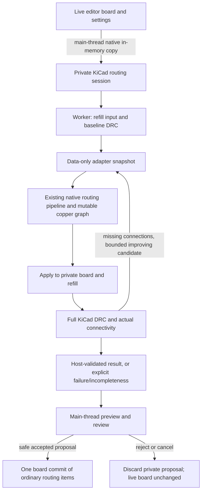

# Freerouting parity: complete acceptance checklist and current status

**Status: NOT at core algorithm parity.** Passing three small boards is a smoke
gate, not the MVP acceptance gate. This document supersedes older descriptions
that call similarly named classes a completed port. It records the entire core
routing acceptance scope, not a percentage based on file counts.

Reference source: `a11c0a42d1b3827e5126429c5c9820c4ab5bec7c`.
Repeatable quality/performance baseline: official Freerouting **v2.3.0**,
`2d4de019aa89e9fa3dc1dc44e09bf509760cafc1`.
The development source and release baseline are different revisions; match
algorithm decisions against the former and measure release quality against the
latter. Never modify the protected reference checkout or build inside it.

## Latest core milestone — active obstacle items and source batch convergence

The geometry foundation now also contains a source-named `IntOctagon` value
type and `ShapeSearchTree45Degree` restraint/completion implementation. The
octagon preserves all eight orthogonal/diagonal support coordinates,
normalization, dimensionality, corners, area, offset, union/intersection,
containment, overlap and boundary comparisons. The minimum-area tree remains a
bounding-box broad phase while its 45-degree leaf path retains exact octagons.
2,048 deterministic core-geometry records and 2,048 private source
`restrainShape` records were generated from a clean GitHub checkout at the
pinned revision and agree with the native implementation. These classes are
built into pcbnew, but the active maze room/door lifecycle is still rectangular:
the 45-degree tree must be connected to octagonal neighbour sorting, doors,
drill rooms and backtracking as one coherent change before it replaces that
safe production path.

The active pipeline now performs one normal routing search per item/pass (plus
the source-style optional neck-width retry) and enables negotiated rip-up on
pass one. Movable rectangular trace/via shapes remain in the room tree as
`ObstacleExpansionRoom` states instead of being globally omitted by a second
search. They compete with free-space detours in the same queue using trace
width, via normal-contact widths, connection detour, early fanout protection,
pass scaling, and the reference's deterministic randomized-pass factor.
Consecutive shapes of one source trace now share an item group and pay the
full rip-up cost once plus the reference's already-ripped continuation cost;
trace/via/trace chains retain separate paid item identities while their native
occupancy connection identity remains available for hard/soft shape matching.
Worker copper now stores a contiguous same-layer/same-style run as one
`PolylineTrace` item rather than treating each corner-to-corner edge as an
item. Exact integral junctions split the complete polyline while retaining
stable identity for its first piece. `Connection.get()` chain/fork traversal,
reverse-ID item/contact order, terminal detection, trace length, item count and
detour are direct translations and feed active obstacle-room rip-up costs when
the mutable item mapping is unambiguous. Non-routable edges and vias touching pins, areas, fixed traces, or other vias
remain hard obstacles. Obstacle-specific neighbour gaps provide the same
one-dimensional free-space entry/exit topology as the orthogonal reference.
Every selected crossing is still resolved by a single insertion transaction.
Within it, same-layer/same-style trace items now follow the reference
`fromCornerNo` loop: an accepted span advances one source corner, a failed
nonfinal span is retried with a later corner, and the first compensated-shape
failure rewinds one accepted approach corner before spring-over. Via and style
boundaries remain atomic, and only the complete reconstructed connection is
published. In addition,
generated and supported straight source traces can spring around the incoming
route recursively, supported vias can move while retaining their normal trace
contacts through bridges, and only unresolved victims consume the bounded
rip-up budget. Pin-entry neckdown is represented by per-edge width/clearance
metadata and complete failed searches can retry at the configured neck width.

Each routing pass now rebuilds its source-order to-do snapshot and queues one
pad representative per connected item set, including the source plane
false-work suppression and a stricter exact-island exception for KiCad's
post-refill repair. Bounded `BoardHistory` entries use the source normalized
score (millimetre trace cost, incompletes, DRC, bends and vias), duplicate
suppression, restore counters/ranks, pass-8/pass-4 restoration cadence, local
and global 0.5-point stagnation windows, and one-time fanout-tail recovery.
Native history keeps a DRC-first safety stratum before applying that score; it
will not imitate a reference intermediate state that adds a clearance error.

Fanout now uses dynamic connected/unconnected terminal sets, terminates on the
first inserted drill (or a real same-layer target), relocates its synthetic
landing to actual inserted copper, and preserves successful partial fanout work.
ViaRule traversal is ordered and authoritative: a failed alternative falls
through to the next profile, a selected padstack retains its complete physical
span, attach-SMD policy, and through/blind/buried/microvia kind through fanout,
forced insertion, and KiCad preview materialization. Fanout reserves and checks
only the selected padstack's occupied layers rather than silently widening it
to a through via.
The optimizer now stores exact item-local geometry/styles and transactionally
removes the same fork-expanded `Item.getConnectionItems(NONE)` set as the
source. Compound insertion requests are normalized to their surviving
`PolylineTrace`/drill items after a partial removal; occupancy and congestion
are rebuilt from those exact survivors. Rerouting starts at the post-removal
boundary components, including multi-arm forks, compares
incompletes/vias/length lexicographically, preserves pad groups and branch
contacts, and removes redundant via/trace tails safely. Its
ordinary signal-net path now directly invokes the translated
`BatchAutorouter.autoroutePassesForOptimizingItem` loop. Every optimizer
sub-pass takes a fresh whole-board source-order item snapshot, enables
negotiated rip-up from pass one at the optimizer-calculated cost, retains
successful partial work, and schedules a foreign connection displaced by one
sub-pass in the next sub-pass. The complete nested batch edit is accepted or
rolled back with the selected item transaction. Native synthetic fanout and
plane targets are intentionally excluded from this loop until they are
replaced by source-equivalent drill/conduction-area items; their dedicated via
candidate paths remain active.
Its
`ReadSortedRouteItems` adapter now rescans the mutable worker board after every
item attempt, advances the source's strict x/y/layer cursor, prefers a via over
a trace at an exact key, and allows accepted edits to contribute a later item
in the same pass. Worker insertion-order item IDs preserve the source item-list
tie order; peers at an already-consumed exact x/y/layer key are skipped. A pass
now stops before work when its remaining theoretical normalized-score gain is
below the configured threshold, and after work when its relative gain is below
that threshold. A no-improvement increased-rip-up-cost phase forces the
source's one retry at normal cost, and even passes remove preferred-direction
bias. Trace-selected items receive the source's 0.6 rip-up-cost factor on top
of the current phase cost. The threshold is exposed in the native dialog. A translated
`ViaOptimizer` moves representable two-trace vias according to the
source layer-cost comparisons and moves one-trace fanout/plane vias toward their
trace while keeping plane drills in the exact originally contacted conduction
area. Synthetic fanout/plane terminals follow accepted moves and participate in
transaction rollback. Every proposed position is checked as a complete
replacement route and still has to improve incompletes/vias/length. Active room
cost accounting uses weighted geometric trace costs and the source's
radius-scaled normal/plane via cost, including the pure-SMD discount.

These are substantial active implementations, but **not full parity**. The
obstacle-room slice is rectangular; small-door checks, shove-adjustment queue
state and expansion-time shove alternatives
are not yet complete. Curved/rational contacts and the complete source item
normalization lifecycle remain open. Batch scoring still derives bend/length/via statistics from the
native connection representation rather than serialized source `Item`s, and
reference thread/time-limit orchestration remains open. Arbitrary convex/curved
item shove, layer-specific padstack shapes/clearance classes, host capture of
every configured non-through ViaRule, optimizer moves for arbitrary contact
graphs/exact source trace mutation, and true parallel optimizer scheduling
remain open.
The remaining legacy visibility/raster fallback still uses compatibility cost
units.

Target-item expansion no longer discards an oblique connected trace to its two
endpoints. The rectangular room frontier preserves complete start and target
centre-lines, intersects their integral lattices with reached rooms, and attaches
at an exact point. A diagonal start trace is represented by bounded lattice
samples immediately on both sides of every compensated orthogonal obstacle
cut; it is never seeded from the false corner wedges of its AABB. The same
source-corresponding `TargetItemExpansionDoor` geometry is active in single-
and multilayer room search. Arbitrary item shapes, finite-width convex start
doors and rational endpoints remain open.

## Previous core milestone — exact geometry and recursive fixed-obstacle spring-over

[Geometry/spring-over report](CONVEX-SPRING-OVER-PARITY.md) adds arbitrary-precision
rational line intersections, support-line polylines, bounded convex entrance and
cutout semantics, and recursive two-direction fixed-obstacle contour replacement.
The production orthogonal/rectangle adapter runs inside atomic insertion and
publishes its checked replacement path. All 2,432 pinned Java records agree.
This milestone alone did not include movable-copper shove, full convex room
geometry, partial-progress forced insertion, neckdown, or complete batch/fanout
parity. The source corner-advance/extend/rewind control flow and bounded forms
are now implemented as described above; exact per-span mutable item publication
and the general cases remain open.

## Previous core milestone — normal contacts, atomic insertion, fanout ordering

[Contact/insertion/fanout implementation report](CORE-CONTACT-INSERTION-PARITY.md)
adds source-tested normal-contact predicates, exact integer junction splitting,
transactional candidate insertion/rip-up, allocation-free rollback restoration,
and reference component/pin fanout ordering with actual bounded passes.
It also identifies the variable-width output-model prerequisite for neckdown.
**Full convex/rational geometry and complete forced displacement, shove/neckdown,
batch, and fanout behaviour remain incomplete.** See the latest milestone above
for the bounded active subsets added since this earlier report; no full-port
acceptance box is checked by this work.

## Previous core milestone — direct destination translation, 2026-09-08

[Java → C++ translation audit](DESTINATION-DISTANCE-PARITY.md) replaces the
three substitute destination estimates in the room search with the pinned
component/solder/inner-box algorithm. Its 7,712 Java oracle records are checked
bit-for-bit, including non-binary weights; scoped floating contraction control
closes the first numeric mismatch. Ordinary plane searches now start at the
whole connected terminal set; exact host repair anchors remain explicit.
The legacy fallback is separately named, not falsely described as translated.
This closes a method-level gap, **not** full costs, geometry, insertion or maze
parity. The detailed report records remaining substitutions and validation.

## Previous core milestone — multilayer drills, 2026-09-08

[Active multilayer room/drill search](DRILL-SEARCH-PARITY.md) now runs in the
default production path before the remaining legacy fallback. It adds lazy
rectangular drill-page cutouts, full physical-stack room lookup, drill-layer
queue sections, source-tested page/drill costs, SMD pin-centre candidates,
through-via reconstruction, and exact-junction tail/overlap cleanup. The shared
room lifecycle is used by both the single-layer and multilayer frontiers.
The unused eager drill grid in the old wrapper has been removed; the active
array and candidate allocation have explicit work/size limits.

This is **still not parity**: exact convex/45-degree free-space geometry,
UI cost mapping and (at that milestone) destination heuristics, forced insertion/shove,
real fanout/optimization, and mutable job ownership across refill remain open.
The new report records same-board quality regressions as well as speed changes;
no DRC, via-count, length, or timeout gate is waived.

## Previous rectangular room milestone — 2026-09-08

[Active rectangular room/door search](ROOM-DOOR-SEARCH.md) now replaces the
previous helper-only status for **no-via / single-enabled-layer attempts**.
It includes reference-tested tree traversal, shape completion, neighbour gaps,
door sections, frontier ordering/distance primitives and rectangular 90/45-degree
corridor location. It is not the full 45-degree shape tree, drill/via search,
forced inserter, shove engine or optimizer. At that earlier milestone, multilayer default routing still
used the legacy engine; the later drill milestone above supersedes that limit.
See the milestone report for both passing tests and failed real-board gates.
That milestone’s eighteen pairs preserve the default 555's +3-via failure and expose
two constrained no-via failures: regulator length +12.0%, and native 555 timeout
during post-refill repair (the reference completes it). The report also identifies
loss of job-owned mutable-copper identity across repair snapshots as an open
lifecycle gap, not a completed fix. No gate or timeout was relaxed.

## Previous host-validation milestone — 2026-09-07

- **Production host validation and repair:** the editor's `AUTOROUTER_JOB` now
  uses `board/KicadRoutingSession`. Construction takes an isolated native KiCad
  in-memory copy, including unsaved geometry and independent net settings.
  The core algorithm still consumes data-only snapshots. Refill and DRC operate
  only on the private board, with progress and cancellation, not on the editor.
  No Java, DSN, SES, disk intermediate board, or external router is used.
- **Refill-created disconnections are scheduled:** actual KiCad ratsnest
  anchors on individual `CN_ZONE_LAYER` regions become exact targets. Previously
  the adapter selected arbitrary same-net plane samples and missed zone-to-zone
  disconnections, including nets with zero initial routing tasks. Repair targets
  cannot silently fall back to a different island. Landing points must be far
  enough inside the particular region for the trace width.
- **Bounded repair acceptance:** each repair uses a separate candidate board;
  accept it only if host missing connections strictly decrease and introduced
  DRC count does not increase. Stop on no progress or the pass bound. Do not
  delete/ignore orphan regions or weaken the design rules to pass a board.
- **Truthful result:** `hostValidated`, `hostUnconnected`, `hostNewDrcViolations`,
  `hostRepairPasses`, and validation time are distinct from worker task counts.
  Completion requires completed host checking, zero missing connections, and
  zero introduced DRC violations. Cancelled, incomplete, or error-limit-truncated
  checking cannot validate a proposal. The review dialog shows host results.
  Both the button and the commit handler enforce `CanAcceptProposal()`; safe
  partial acceptance is allowed, unchecked/violating/cancelled acceptance is not.
  The editor no longer skips host checking just because its pre-refill ratsnest
  has no edges. Sessions are single-use and late cancellation clears validation.
- **Same editor and QA entry point:** default native A/B runs use this host
  session too. Explicit `--max-connections` remains raw-worker diagnosis, not
  the production completion test. Engine time and host validation time are
  recorded separately; `host_session_ms` includes the native copy/setup, engine,
  refill, DRC and repair. Native copy/setup is not engine routing time.
- **DRC provider lifetime:** KiCad's registry contains mutable singleton test
  providers. Initializing a private engine changed their owner, leaving an older
  engine pointing through a destroyed private engine on its next run. DRC now
  rebinds providers at each run and serializes initialization/test use across
  engines. `TestsCompleted()` distinguishes a full run from early exit.
  The single-rule/show-matches provider set remains intact. The independent QA
  checker also refuses truncated checking. Unconnected-marker limits are not
  mistaken for incomplete DRC: full connectivity is separately counted without
  that marker cap, so large initially unrouted boards are not rejected for it.
- **Snapshot serialization:** a new opt-out preserves the source board's
  embedded-font state while serializing a private snapshot. Normal save callers
  retain the previous default behavior. Proposal net codes are translated back
  by net name and original tracks are identified by UUID.

At that milestone the saved 555 board completed through the production path
after one post-refill repair, with zero KiCad missing connections and zero DRC violations.
Repeated measurements and durable evidence are recorded below.

### Current production boundary



The repeated edge is implemented using an independent candidate board. It does
not mutate the retained best proposal until the candidate passes the improvement
checks. The native pipeline box is still **not** a reference-equivalent port.

## Remaining core parity work

Every row below is required or needs an explicit, justified host adaptation.
“Partial” means implemented behavior exists, not equivalent behavior.

| Area | Current state and what must still be implemented | Required proof |
|---|---|---|
| **1. Geometric primitives** | **Partial.** Exact rational line intersections, line-array polylines and bounded convex entrance/polyline-cutout semantics are source-tested and used by fixed-obstacle spring-over. Source-named `IntOctagon` core operations and `ShapeSearchTree45Degree.restrainShape` now pass 4,096 pinned Java records and are production-built. The active maze lifecycle still uses rectangular rooms. General `TileShape` offsets/cutouts, unbounded/degenerate simplex behavior, octagonal neighbour/door/drill propagation and arbitrary convex room search remain absent. KiMath shapes and conservative adapter contours are not yet full upstream `IntBox`/`IntOctagon`/`Simplex`/`TileShape`/`Polyline` semantics. Curved/custom copper and holes must not create false contacts or close routable channels. | Extend the pinned differential corpus to full octagon cutout/projection, degenerate/negative/large coordinates, tangencies, acute angles, narrow corridors, holes, 90/45/any-angle cases; then run the active room topology against source decisions. |
| **2. Mutable item model and contacts** | **Partial.** Physical and separate source-tested endpoint/centre normal-contact graphs now exist. A same-layer/same-style run is one polyline item; exact integer junctions split complete polylines with stable first-piece identity and transaction rollback. `Connection.get()` and `Item.getConnectionItems(NONE)` use source reverse-ID contact iteration and chain/fork/terminal traversal, with exact item-set trace length and detour. Each mutable item retains exact standalone geometry and manufacturing style; exact item subsets can be removed atomically while occupancy is rebuilt from surviving item records. Retained straight copper can be split virtually without editing host items. Paid obstacle rooms distinguish native occupancy connections from source trace/via items. Need rational/curved contacts, full source split/combine normalization, entry restrictions, fixed-state semantics, and precise contact preservation during every general shove/change. Immutable host cluster unions and outward-approximated contacts are not a completed port. | Insert/split/join/remove/shove/rollback contact graphs compared to reference, plus independent KiCad connectivity. |
| **3. Rules and clearance compensation** | **Partial.** Pair/layer clearances, widths, edge and hole constraints exist. Need complete clearance classes/compensation, item-specific and layer-specific padstack geometry and width rules. Dummy-track rule evaluation cannot fully represent rules conditional on actual item/footprint/geometry. Do not silently claim unsupported contextual rules are enforced by search. | Per-constraint adapter tests and matching host/reference DRC thresholds; deliberately conflicting and non-default rules. |
| **4. Spatial search trees** | **Partial, now active.** `MinAreaTree` insertion/removal/traversal and orthogonal `completeShape`, restraint and ignore-object/overlap semantics are ported and differentially tested. The host supplies conservative, fully expanded centre-space rectangles and rebuilds them per attempt. Still need exact compensation classes, 45/general convex trees, incremental trace updates and room invalidation/reuse after edits. | Multi-obstacle completion sequences, stable visitation/tie order, insertion/removal invalidation and exact free-space coverage. |
| **5. Rooms and doors** | **Active rectangular subset.** Free/incomplete/complete rooms, paid obstacle rooms, source-specific orthogonal obstacle gaps, sorted touching neighbours, overlap doors, section geometry and neighbour-completion lifecycle run in single-layer and multilayer attempts. Exact integral point/axis/oblique trace starts and targets now attach through their intersection with each reached rectangular room rather than a diagonal AABB or endpoint-only approximation. Diagonal starts use bounded exact lattice samples around every orthogonal room cut. Still need full convex/45 geometry, finite-width pad/area/general item-region doors, rational endpoints, thin-room/acute-corner and small-door handling, and nonrectangular drill reachability. | Active path must actually visit rooms/door sections, with normalized reference traces—not a unit helper called only by tests. |
| **6. Maze frontier/backtracking** | **Partial, not full equivalence.** The room/drill slice has door-section and drill-layer state, entry geometry, backtracking, paid obstacle-room transitions, exact integral oblique-trace start/target attachment, and the reference f/g/door-ID/section queue key (including equal-key suppression). Its target IDs are host-local, and its geometry/target regions are otherwise restricted. Default multilayer work uses this frontier first; unsupported/rejected proposals retain grid/visibility fallback. Need exact small-door, shove-adjustment/requeue, item-chain, general target-region and alternative-padstack state plus normalized end-to-end reference decision streams. | First normalized routing-decision divergence, repeated deterministic checkpoints, and boards with routes unavailable to the old grid. |
| **7. Drill/via expansion** | **Partial.** Lazy rectangular drill pages, cutout ordering, full-stack room lookup, drill-layer expansion, SMD pin-centre substitution, and separate geometry invalidation/maze reset now run. Ordered multiple ViaRule entries are selected by transition containment and exact geometry; complete through/blind/buried/microvia spans and types survive reconstruction. Need host capture of configured non-through rule entries, per-layer padstack shapes/clearance classes, nonrectangular/acute drill geometry, thin-room and forced-pad checks, and incremental cross-attempt cache invalidation/reuse. | Multilayer fixtures with inactive layers, asymmetric pads, alternative via rules, blocked intermediate layers and drill spacing. |
| **8. Routing costs and heuristic** | **Not equivalent overall.** The room frontier uses reference weighted Euclidean distance, normalized bend detection, radius-scaled via costs, and source-shaped obstacle rip-up costs (width/contact factor, exact `Connection.get()` detour where mutable item mapping is unambiguous, fanout protection, pass scaling/randomization and once-per-item continuation). Queue/distance primitives have Java oracles. Batch history now uses the normalized source score and default weights, but bends/length/vias are reconstructed from native connections and the DRC-first safety stratum is an intentional host adaptation. UI direction/bend-unit mapping remains adapted. The fallback retains grid-normalized lengths, fixed direction penalties and retry-scaled via costs. Static source routes and fork-split obstacle shapes still fall back to connection-record estimates. Need exact preferred/nonpreferred UI mapping, queue-time shove costs and ordering. | Numeric oracle plus path/order comparisons; no clearance/completion regression and measured time/memory. The prior isolated cost change was rejected for a large runtime regression. |
| **9. Path location** | **Active rectangular 90/45 subset.** `FoundConnectionLocator45Degree` is no longer an alias: it locates a backtracked rectangular corridor using nearest door/overlap entries and reference corner construction, without searching again. Ordered padstack selection and complete span/type reconstruction are active, including fanout. Oblique trace starts and targets attach at exact integral points inside reached rooms. Still need full convex/acute/thin-room, general pad/area attachment, rational trace contacts and exact partial neckdown reconstruction. The legacy locator and any-angle alias remain unported. | Every reconstructed edge and contact agrees with reference constraints before insertion; adversarial short/acute/narrow corridors. |
| **10. Forced insertion and speculative undo** | **Partial, active.** Candidate insertion now translates the Java `fromCornerNo` trace loop across each same-layer/style item: successful spans advance, failed nonfinal spans extend to later corners, and the first correction rewinds one accepted approach corner. Vias remain atomic and only a complete reconstructed connection is published inside one occupancy/board transaction. The transaction resolves the full victim set, recursively springs supported generated/source traces, moves supported vias with normal-contact bridges, publishes every replacement, and rolls back geometry, contacts, route maps and usage on failure/cancellation. Need exact per-span mutable `insertForcedTracePolyline` item publication/combination, sampled partial-segment shove points, general item/contact splitting, all cache invalidation, conduction-area mutation, and unsupported item types. | Failed insertions restore all internal state; successful insertions update actual copper. Editor acceptance undo is tested separately. |
| **11. Shove, spring-over, neckdown** | **Partial, active bounded subset.** Recursive two-direction fixed and movable straight-trace spring-over runs during checked insertion. Uniform vias with supported trace/area contacts can move atomically; bridges preserve old-centre contacts. Pin-entry and whole-connection neck-width retries carry variable edge styles. Need general compensated convex/curved shove, source-equivalent recursion/stack limits and alternatives, forced pad displacement, arbitrary drill contact graphs, and exact partial neckdown lengths. KiCad rule compliance must not be relaxed to imitate reference violations. | Congested fixtures that require displacement rather than reroute alone, exact affected-item logs, and full DRC after each committed operation. |
| **12. Batch scheduling and rip-up** | **Partial, active source-order adapter.** Every pass snapshots one natural-order representative per current connected item set, performs one normal search plus optional neck retry per item/pass, enables pass-one rip-up, retains successful components, and records bounded duplicate-free history. Source normalized scoring, restore counts/ranks, pass-8/modulo-4 restore checks, local/global stagnation thresholds and one-time fanout-tail recovery are active; final selection remains DRC-first. One room frontier compares detours with pass-scaled paid obstacle items and insertion resolves concrete victims. Need exact source item IDs/iteration across generated traces/vias, `Connection.get()` chain removal, small-door and shove-before-rip requeue state, exact whole-board statistics, multi-thread pass competition, and reference job/time-limit semantics. | Per-pass connected sets, attempted item order, removed items and costs, stop decisions and retained checkpoints compared to reference. |
| **13. Fanout** | **Partial, active.** Source-tested component/pin sorting drives actual bounded passes. Searches use dynamic connected/unconnected item terminals, small-net nearest-target fallback, source pass-scaled per-pin budgets, first-drill/same-layer termination, actual landing relocation, ordered net-plus-board ViaRule alternatives, complete selected padstack span/type, early-pass fanout-via rip-up protection, zero-progress/geometry-repeat/three-pass state-repeat convergence, and successful partial-work retention. Failed synthetic landings are removed before ordinary routing. Need host capture of the complete configured board/net ViaRules and layer-local padstack geometry, reference drill-room fanout rather than the bounded synthetic escape adapter, dense BGA policy and broad corpus proof. | Fine-pitch/BGA/through-hole/mixed fixtures, constrained layers, multiple via rules and via-in-pad enabled/disabled; no dangling vias/stubs. |
| **14. Optimization** | **Partial, active serial implementation.** The optimizer removes the source-equivalent fork-expanded `Item.getConnectionItems(NONE)` set transactionally and normalizes surviving item records. Ordinary signal items now run the translated `BatchAutorouter.autoroutePassesForOptimizingItem` loop: fresh whole-board item snapshots, pass-one negotiated rip-up at the calculated optimizer price, successful partial-work retention, and following-pass rebatching of displaced foreign connections all occur inside the selected item's snapshot. A regression requires such a foreign connection to be changed and restored while improving the complete board. Native synthetic fanout/plane targets remain on dedicated candidates because feeding them to the ordinary adapter can bypass or duplicate their required SMD escape. The bounded boundary-component reroute remains as a fallback. `ReadSortedRouteItems` performs the source's dynamic full-board rescan after every attempt, with the strict monotonic x/y/layer cursor, via-first exact-tie behavior, mutable-via-connected trace suppression and insertion-order tie stability. Source normalized-score potential/actual improvement thresholds, increased-cost-to-normal-cost phase transition, per-trace 0.6 rip-up scaling, and odd/even preferred-direction variation are active. `ViaOptimizer` ports weighted two-trace position candidates plus bounded one-trace fanout/plane movement. Need complete 90/45/any-angle `optChangedArea` pull-tight, arbitrary via contact mutation/recursion, exact trace-combine/via-removal behavior, source minimum-cumulative-length accounting, and removal of the synthetic fanout/plane exception. `BatchOptimizerMultiThreaded` still delegates serially and lacks global-optimal/greedy/hybrid scheduling. | Completion and full DRC must never degrade; compare via count, length, candidate scores, time and peak memory. |
| **15. Plane semantics** | **Improved but partial.** Host refill/repair fixes the default 555 island failure, but its no-via case still times out. Repair snapshots freeze earlier job-owned copper together with user copper; preserve ownership and mutable contacts across refill before implementing safe removal/rerouting. Core still uses sampled plane targets rather than full conduction-region search, has no dynamic void/split model during routing and no reference-equivalent plane stopping/via optimization. Exact island anchors are a host compatibility measure, not that port. | Outer/inner planes, multiple islands, holes, thermals, split/merged pours, zero-initial-task nets, mixed-net tracks cutting pours, repeated refill, and original/job-owned-copper preservation during rejected/accepted repairs. |
| **16. Integration, safety and lifecycle** | **Partial.** Native action, settings, worker cancellation, preview, private validation and one track/via acceptance commit exist. Need complete rejection/undo/redo tests with zones and existing copper, preview/refilled-zone consistency, unsaved/custom rules and classes, invalid/unsupported-input handling, concurrent jobs/cancellation latency and no accidental live model access. Acceptance currently commits routing items; zone refill display/undo is not fully covered. | GUI tests on the built application, board serialization equality after reject/cancel, one-step undo/redo, exact post-accept refill equivalence and distinct validation-failure states. |

### Explicit exclusions (not gaps to “port”)

Do not import the Freerouting GUI, interactive editor, REST/MCP server, analytics,
authentication, cloud management, session persistence or Java runtime. DSN/SES
and the Java release JAR are **QA reference tools only**. Source filenames and
package correspondence should be preserved where meaningful, but naming is not
an acceptance test. A native board snapshot/validation adapter is intentionally
host-specific and does not need a Java counterpart.

## Required validation before calling the MVP parity-complete

- [ ] Pin source/reference release, rules, seeds, engine flags and fixture hashes.
- [ ] Golden differential geometry tests for all supported angle modes.
- [ ] Active room/door, drill, search ordering and locator decision traces.
- [ ] Insert/shove/neckdown/rollback and contact-normalization regressions.
- [ ] At least two bounded item/pass checkpoints per challenging fixture;
      identify the first stable decision divergence and classify numeric versus
      ordering/behavioral differences. Synchronize diagnostic fields first.
- [ ] Actual boards beyond the three simple assets: dense SMD, BGA, large
      multipin nets, 4+ layers, inactive intermediate layers, multiple via rules,
      narrow corridors, retained/locked copper, custom pads, curved obstacles,
      holes/keepouts, inner/outer planes and multiple clearance classes.
- [ ] Route the same normalized inputs with both engines, repeat each run,
      materialize ordinary KiCad objects and refill **both** outputs.
- [ ] Zero new host clearance/manufacturing violations; report all remaining
      host connectivity, including zone-only disconnections. A comparator must
      fail if a native “100%” output is physically incomplete.
- [ ] No completion regression against v2.3.0; compare via counts and lengths
      only after safety/completion pass. Reference violations do not authorize
      native violations or weakening the board's rules.
- [ ] Time routing, optimization, host validation and startup separately; measure
      peak resident memory, not cumulative allocations. Set and record fixture
      budgets; do not hide timeouts by changing inputs, rules or engine settings.
- [ ] Native UI cancellation, review, accept/reject, undo/redo and launch-artifact
      identity are verified. Rebuilding a library is not a GUI acceptance test.
- [ ] Every unsupported reference core capability is either implemented or
      explicitly rejected in the UI—not silently skipped or named as “ported”.

## Implementation order from here

1. Preserve full host validation; close the constrained 555 repair failure
   with explicit original/job-owned copper ownership, not blanket existing rip-up.
   Keep default and constrained benchmarks separate; expand the corpus.
2. Finish geometry, clearance compensation, item contacts and general via rules.
3. Port an **active end-to-end** room/door search + locator + transactional
   inserter, extending the active rectangular single/multilayer slice to exact 45/general convex cases and general via rules.
   Do not substitute another graph/grid router and rename it.
4. Extend the active forced shove/spring-over/neckdown subset to general item
   geometry and exact per-span mutable insertion; then match obstacle-room rip-up, batch,
   and fanout decisions.
5. Complete optimizer chain/via behavior and parallel scheduling; validate
   quality and resource budgets across the broader corpus before calling
   practical parity achieved.

Do not mark the unchecked rows done because the current three boards route.

## Measured results after this change — 2026-09-07

All three saved originals were stripped identically in memory, routed by both
engines, independently materialized/refilled/checked by KiCad, and repeated three
times. Both optimizers were disabled; four routing passes, eight native retry
iterations, 250,000 native expanded-node limit and a 180-second process limit
were recorded, not changed to force a passing result. Reference automatic
neckdown was disabled. Input PCB/project/rule hashes were checked unchanged.

Values below are **native / Freerouting v2.3.0**. Time values are medians. Counts
and lengths were identical across all three repeats.

| Board | Actual missing | New KiCad DRC | Vias | Track length, mm | Core time, s | Native host session, s | Strict comparator |
|---|---:|---:|---:|---:|---:|---:|---|
| 5 V regulator | 0 / 0 | 0 / 0 | 0 / 0 | 323.371 / 319.203 | 1.022 / 0.430 | 1.078 | Pass, 3/3 |
| 555 astable | 0 / 0 | 0 / 10 | 10 / 7 | 96.297 / 184.248 | 0.284 / 2.390 | 0.457 | **Fail, 3/3: three extra native vias** |
| BJT astable | 0 / 0 | 0 / 0 | 0 / 0 | 147.897 / 152.435 | 0.019 / 0.290 | 0.046 | Pass, 3/3 |

The native 555 output also has **zero total** KiCad DRC reports, not merely zero
new reports. One improving post-refill repair joins the split ground region.
The reference's ten reports remain nine minimum-width violations and one
dangling via; this is not a clean reference result. They do not justify relaxing
native DRC. The comparator's default zero-extra-vias and +10% maximum-length
gates have **not** been weakened. Practical quality parity therefore still fails
even on this small corpus, and the regulator remains slower.

Native core time includes fanout, routing and repair routing, not native
copy/setup/refill/DRC. Native host-validation overhead medians are 47, 170 and
23 ms respectively. Host-session time includes initial copy/setup as well.
Reference core time sums its logged fanout/routing stages, rounded to hundredths
of a second; JVM startup and I/O are excluded. Full process wall time and
commands are retained in provenance. Router peak-memory/scaling and optimizer
parity have not been established by these measurements.

### Verification and remaining test failure

- Build: PCB editor module, `qa_pcbnew`, and `qa_autorouter_parity` succeeded.
- Native suite: **52 cases / 9,472 assertions passed**. Added host copy/net-code,
  DRC-engine lifetime, split-plane repair, impossible repair, worker execution,
  pre-start/post-routing cancellation and acceptance-gate regressions.
- Combined native/DRC/zone suites: **286 cases / 11,645 assertions passed**.
- Python comparator/timing tests: **15 passed**. Raw-worker runs cannot pass the
  production gate; independent host results must agree; extra vias still fail.
- All **18 saved routed boards** (both engines, all repetitions) were reloaded
  with no matching routing net selected. No geometry was generated, file bytes
  stayed unchanged, and connectivity, DRC category counts, vias and lengths
  matched the original measurements.
- Full PCB suite: **2,376/2,377 cases passed (19 with warnings)**;
  `MatchProperties/KeysAreCanonicalAndLabelsAreFriendly` failed two label
  assertions (197,881/197,883 assertions passed). It passes alone and with all
  native autorouter tests, but fails with the preceding test suites even when
  `NativeAutorouter` is excluded. Its code/tests were not changed. This
  order-dependent failure is recorded, not waived or called a green full suite.
- No GUI review/accept/reject/undo automation was run in this pass. A rebuilt
  module and worker tests do not establish those UI acceptance criteria.

### Durable local evidence

Saved independently of the build directory at
[`autorouter-test-assets/online-simple/parity-closure-2026-09-07/`](/Users/jmcasler/Documents/GitHub/mchamster/kicad-source-mirror-autorouter/autorouter-test-assets/online-simple/parity-closure-2026-09-07/README.md).
This includes all normalized/routed boards, DSN/SES reference artifacts, metrics,
commands and binary/reference hashes, reload checks, build/test logs, the exact
native source patch and a SHA-256 manifest. Earlier measurements are preserved
separately and not overwritten. Third-party boards remain local/Git-ignored.

To rerun a case using the saved original (choose a new output directory):

```sh
python3 scripts/autorouter/run_parity_case.py \
  --board 'autorouter-test-assets/online-simple/555-astable/original/555 Astable multivibrator.kicad_pcb' \
  --reference-jar build/autorouter/online-simple-stable/reference/freerouting-2.3.0.jar \
  --reference-commit 2d4de019aa89e9fa3dc1dc44e09bf509760cafc1 \
  --output-dir build/autorouter/next-555-comparison \
  --strip-tracks --save-boards --max-passes 4 --max-iterations 8 \
  --max-expanded-nodes 250000 --timeout-seconds 180
```

Expected current comparator exit for the 555 is **1**, not success. Completion
and safety are repaired; core algorithm and via-quality parity are not finished.
