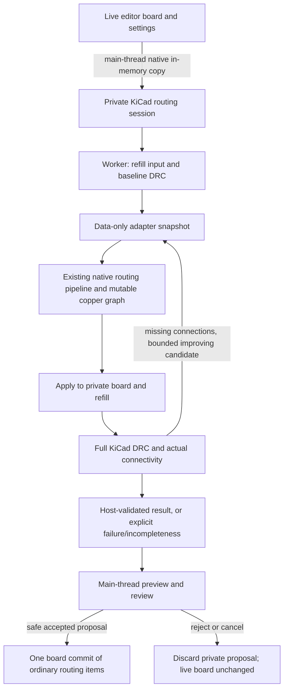

# Freerouting parity: complete acceptance checklist and current status

**Status: NOT at core algorithm parity.** Passing three small boards is a smoke
gate, not the MVP acceptance gate. This document supersedes older descriptions
that call similarly named classes a completed port. It records the entire core
routing acceptance scope, not a percentage based on file counts.

Reference source: `a11c0a42d1b3827e5126429c5c9820c4ab5bec7c`.
Repeatable quality/performance baseline: official Freerouting **v2.3.0**,
`2d4de019aa89e9fa3dc1dc44e09bf509760cafc1`.
The development source and release baseline are different revisions; match
algorithm decisions against the former and measure release quality against the
latter. Never modify the protected reference checkout or build inside it.

## Latest core milestone — direct destination translation, 2026-09-08

[Java → C++ translation audit](DESTINATION-DISTANCE-PARITY.md) replaces the
three substitute destination estimates in the room search with the pinned
component/solder/inner-box algorithm. Its 7,712 Java oracle records are checked
bit-for-bit, including non-binary weights; scoped floating contraction control
closes the first numeric mismatch. Ordinary plane searches now start at the
whole connected terminal set; exact host repair anchors remain explicit.
The legacy fallback is separately named, not falsely described as translated.
This closes a method-level gap, **not** full costs, geometry, insertion or maze
parity. The detailed report records remaining substitutions and validation.

## Previous core milestone — multilayer drills, 2026-09-08

[Active multilayer room/drill search](DRILL-SEARCH-PARITY.md) now runs in the
default production path before the remaining legacy fallback. It adds lazy
rectangular drill-page cutouts, full physical-stack room lookup, drill-layer
queue sections, source-tested page/drill costs, SMD pin-centre candidates,
through-via reconstruction, and exact-junction tail/overlap cleanup. The shared
room lifecycle is used by both the single-layer and multilayer frontiers.
The unused eager drill grid in the old wrapper has been removed; the active
array and candidate allocation have explicit work/size limits.

This is **still not parity**: exact convex/45-degree free-space geometry,
UI cost mapping and (at that milestone) destination heuristics, forced insertion/shove,
real fanout/optimization, and mutable job ownership across refill remain open.
The new report records same-board quality regressions as well as speed changes;
no DRC, via-count, length, or timeout gate is waived.

## Previous rectangular room milestone — 2026-09-08

[Active rectangular room/door search](ROOM-DOOR-SEARCH.md) now replaces the
previous helper-only status for **no-via / single-enabled-layer attempts**.
It includes reference-tested tree traversal, shape completion, neighbour gaps,
door sections, frontier ordering/distance primitives and rectangular 90/45-degree
corridor location. It is not the full 45-degree shape tree, drill/via search,
forced inserter, shove engine or optimizer. At that earlier milestone, multilayer default routing still
used the legacy engine; the later drill milestone above supersedes that limit.
See the milestone report for both passing tests and failed real-board gates.
That milestone’s eighteen pairs preserve the default 555's +3-via failure and expose
two constrained no-via failures: regulator length +12.0%, and native 555 timeout
during post-refill repair (the reference completes it). The report also identifies
loss of job-owned mutable-copper identity across repair snapshots as an open
lifecycle gap, not a completed fix. No gate or timeout was relaxed.

## Previous host-validation milestone — 2026-09-07

- **Production host validation and repair:** the editor's `AUTOROUTER_JOB` now
  uses `board/KicadRoutingSession`. Construction takes an isolated native KiCad
  in-memory copy, including unsaved geometry and independent net settings.
  The core algorithm still consumes data-only snapshots. Refill and DRC operate
  only on the private board, with progress and cancellation, not on the editor.
  No Java, DSN, SES, disk intermediate board, or external router is used.
- **Refill-created disconnections are scheduled:** actual KiCad ratsnest
  anchors on individual `CN_ZONE_LAYER` regions become exact targets. Previously
  the adapter selected arbitrary same-net plane samples and missed zone-to-zone
  disconnections, including nets with zero initial routing tasks. Repair targets
  cannot silently fall back to a different island. Landing points must be far
  enough inside the particular region for the trace width.
- **Bounded repair acceptance:** each repair uses a separate candidate board;
  accept it only if host missing connections strictly decrease and introduced
  DRC count does not increase. Stop on no progress or the pass bound. Do not
  delete/ignore orphan regions or weaken the design rules to pass a board.
- **Truthful result:** `hostValidated`, `hostUnconnected`, `hostNewDrcViolations`,
  `hostRepairPasses`, and validation time are distinct from worker task counts.
  Completion requires completed host checking, zero missing connections, and
  zero introduced DRC violations. Cancelled, incomplete, or error-limit-truncated
  checking cannot validate a proposal. The review dialog shows host results.
  Both the button and the commit handler enforce `CanAcceptProposal()`; safe
  partial acceptance is allowed, unchecked/violating/cancelled acceptance is not.
  The editor no longer skips host checking just because its pre-refill ratsnest
  has no edges. Sessions are single-use and late cancellation clears validation.
- **Same editor and QA entry point:** default native A/B runs use this host
  session too. Explicit `--max-connections` remains raw-worker diagnosis, not
  the production completion test. Engine time and host validation time are
  recorded separately; `host_session_ms` includes the native copy/setup, engine,
  refill, DRC and repair. Native copy/setup is not engine routing time.
- **DRC provider lifetime:** KiCad's registry contains mutable singleton test
  providers. Initializing a private engine changed their owner, leaving an older
  engine pointing through a destroyed private engine on its next run. DRC now
  rebinds providers at each run and serializes initialization/test use across
  engines. `TestsCompleted()` distinguishes a full run from early exit.
  The single-rule/show-matches provider set remains intact. The independent QA
  checker also refuses truncated checking. Unconnected-marker limits are not
  mistaken for incomplete DRC: full connectivity is separately counted without
  that marker cap, so large initially unrouted boards are not rejected for it.
- **Snapshot serialization:** a new opt-out preserves the source board's
  embedded-font state while serializing a private snapshot. Normal save callers
  retain the previous default behavior. Proposal net codes are translated back
  by net name and original tracks are identified by UUID.

At that milestone the saved 555 board completed through the production path
after one post-refill repair, with zero KiCad missing connections and zero DRC violations.
Repeated measurements and durable evidence are recorded below.

### Current production boundary



The repeated edge is implemented using an independent candidate board. It does
not mutate the retained best proposal until the candidate passes the improvement
checks. The native pipeline box is still **not** a reference-equivalent port.

## Remaining core parity work

Every row below is required or needs an explicit, justified host adaptation.
“Partial” means implemented behavior exists, not equivalent behavior.

| Area | Current state and what must still be implemented | Required proof |
|---|---|---|
| **1. Geometric primitives** | **Partial.** KiMath shapes and conservative adapter contours are not upstream `IntBox`/`IntOctagon`/`Simplex`/`TileShape`/`Polyline` semantics. Need convex decomposition, offsets, intersections, cutouts, dimensionality, rational/rounded intersections, angle restrictions and deterministic boundary/tie conventions. Curved/custom copper and holes must not create false contacts or close routable channels. | Pinned Java differential geometry corpus: degenerate/negative/large coordinates, tangencies, acute angles, narrow corridors, holes, 90/45/any-angle cases. |
| **2. Mutable item model and contacts** | **Partial.** Physical pad/trace/via/region graph and exact centre-line junction/tail cleanup exist. Need full upstream normal-contact semantics, stable trace splitting/normalization, contact points and entry restrictions, fixed-state/item-level rip-up, removal chains, and precise contact preservation during changes. Immutable host cluster unions and outward-approximated contacts are not a completed port. | Insert/split/join/remove/shove/rollback contact graphs compared to reference, plus independent KiCad connectivity. |
| **3. Rules and clearance compensation** | **Partial.** Pair/layer clearances, widths, edge and hole constraints exist. Need complete clearance classes/compensation, item-specific and layer-specific padstack geometry and width rules. Dummy-track rule evaluation cannot fully represent rules conditional on actual item/footprint/geometry. Do not silently claim unsupported contextual rules are enforced by search. | Per-constraint adapter tests and matching host/reference DRC thresholds; deliberately conflicting and non-default rules. |
| **4. Spatial search trees** | **Partial, now active.** `MinAreaTree` insertion/removal/traversal and orthogonal `completeShape`, restraint and ignore-object/overlap semantics are ported and differentially tested. The host supplies conservative, fully expanded centre-space rectangles and rebuilds them per attempt. Still need exact compensation classes, 45/general convex trees, incremental trace updates and room invalidation/reuse after edits. | Multi-obstacle completion sequences, stable visitation/tie order, insertion/removal invalidation and exact free-space coverage. |
| **5. Rooms and doors** | **Active rectangular subset.** Free/incomplete/complete rooms, sorted touching neighbours/gaps, overlap doors, section geometry and neighbour-completion lifecycle run in single-layer and multilayer attempts. Still need full convex/45 geometry, obstacle rooms, real item-region target doors, thin-room/acute-corner handling and nonrectangular drill reachability. Other similarly named classes remain shells. | Active path must actually visit rooms/door sections, with normalized reference traces—not a unit helper called only by tests. |
| **6. Maze frontier/backtracking** | **Partial, not full equivalence.** The room/drill slice has door-section and drill-layer state, entry geometry, backtracking and the reference f/g/door-ID/section queue key (including equal-key suppression). Its target IDs are host-local, and its geometry/target regions are restricted. Default multilayer work uses this frontier first; unsupported/rejected proposals retain grid/visibility fallback. Need full target-region, rip-up/shove/alternative-padstack state and normalized end-to-end reference decision streams. | First normalized routing-decision divergence, repeated deterministic checkpoints, and boards with routes unavailable to the old grid. |
| **7. Drill/via expansion** | **Partial.** Lazy rectangular drill pages, cutout ordering, full-stack room lookup, drill-layer expansion, SMD pin-centre substitution, and separate geometry invalidation/maze reset now run. Need nonrectangular/acute drill geometry, thin-room and forced-pad checks, masks, multiple via rules, blind/buried/microvia padstacks where upstream supports them, and incremental cross-attempt cache invalidation/reuse. | Multilayer fixtures with inactive layers, asymmetric pads, alternative via rules, blocked intermediate layers and drill spacing. |
| **8. Routing costs and heuristic** | **Not equivalent overall.** The room frontier now uses reference weighted Euclidean distance and normalized bend detection; queue/distance primitives have Java oracles. Legacy batch score compatibility and UI direction/bend-unit mapping remain adaptations. The fallback retains grid-normalized lengths, fixed direction penalties and retry-scaled via costs, while the new drill frontier uses radius-scaled via cost (including the source-pin pure-SMD discount). The component/solder/inner-box destination estimate is now a direct, bit-tested translation, wired into both room frontiers through an explicit IU adapter. LegacyDestinationDistance remains isolated to the raster fallback; native UI cost mapping and target-region modeling still differ. Need exact preferred/nonpreferred costs, normal/plane via costs, rip-up costs, admissible destination estimates and ordering. Change them together with frontier state, not one coefficient at a time. | Numeric oracle plus path/order comparisons; no clearance/completion regression and measured time/memory. The prior isolated cost change was rejected for a large runtime regression. |
| **9. Path location** | **Active rectangular 90/45 subset.** `FoundConnectionLocator45Degree` is no longer an alias: it locates a backtracked rectangular corridor using nearest door/overlap entries and reference corner construction, without searching again. Still need full convex/acute/thin-room, pad/trace/area attachment, neckdown and nonrectangular/multiple-padstack reconstruction. Rectangular through-drill reconstruction is active. The legacy locator and any-angle alias remain unported. | Every reconstructed edge and contact agrees with reference constraints before insertion; adversarial short/acute/narrow corridors. |
| **10. Forced insertion and speculative undo** | **Missing.** Current inserter materializes already-found coordinate edges. Need `insertForcedTracePolyline`/via-equivalent operations, trace contact splitting, partial insertion failure, atomic rollback of geometry, contacts, occupancy and all search caches. A private transaction exists but is not yet the production forced-insertion transaction. | Failed insertions restore all internal state; successful insertions update actual copper. Editor acceptance undo is tested separately. |
| **11. Shove, spring-over, neckdown** | **Missing.** `MazeTraceShover::Shorten` is not shove. Need recursive local trace/via displacement, recursion/depth limits, fixed obstacles, alternate spring-over paths, pin escapes and neckdown where legal. KiCad rule compliance must not be relaxed to imitate reference violations. | Congested fixtures that require displacement rather than reroute alone, exact affected-item logs, and full DRC after each committed operation. |
| **12. Batch scheduling and rip-up** | **Partial/alternate.** Shortest-edge connected-component growth and negotiated crossing are not reference item selection. Need equivalent item/net ordering, routing direction (including planes), pass escalation, connection-chain rip-up, stopping/cycle detection and best-board restoration based on physical quality. | Per-pass connected sets, attempted item order, removed items, stop decisions and retained checkpoints compared to reference. |
| **13. Fanout** | **Partial.** Synthetic escape planning and safe cleanup exist. Need component/pin sorting, dense/BGA breakout, actual feasible via landing search, fanout pass policy and reference handling of successful versus failed fanouts. | Fine-pitch/BGA/through-hole/mixed fixtures, constrained layers and via-in-pad enabled/disabled; no dangling vias/stubs. |
| **14. Optimization** | **Missing beyond guarded shortening/cleanup.** Need 90/45/any-angle pull-tight, contact-preserving corner movement, via reposition/removal, plane/fanout via optimization, rerouting candidate selection/scoring, pass termination and actual parallel optimizer semantics (current multi-threaded class delegates serially). | Completion and full DRC must never degrade; compare via count, length, candidate scores, time and peak memory. |
| **15. Plane semantics** | **Improved but partial.** Host refill/repair fixes the default 555 island failure, but its no-via case still times out. Repair snapshots freeze earlier job-owned copper together with user copper; preserve ownership and mutable contacts across refill before implementing safe removal/rerouting. Core still uses sampled plane targets rather than full conduction-region search, has no dynamic void/split model during routing and no reference-equivalent plane stopping/via optimization. Exact island anchors are a host compatibility measure, not that port. | Outer/inner planes, multiple islands, holes, thermals, split/merged pours, zero-initial-task nets, mixed-net tracks cutting pours, repeated refill, and original/job-owned-copper preservation during rejected/accepted repairs. |
| **16. Integration, safety and lifecycle** | **Partial.** Native action, settings, worker cancellation, preview, private validation and one track/via acceptance commit exist. Need complete rejection/undo/redo tests with zones and existing copper, preview/refilled-zone consistency, unsaved/custom rules and classes, invalid/unsupported-input handling, concurrent jobs/cancellation latency and no accidental live model access. Acceptance currently commits routing items; zone refill display/undo is not fully covered. | GUI tests on the built application, board serialization equality after reject/cancel, one-step undo/redo, exact post-accept refill equivalence and distinct validation-failure states. |

### Explicit exclusions (not gaps to “port”)

Do not import the Freerouting GUI, interactive editor, REST/MCP server, analytics,
authentication, cloud management, session persistence or Java runtime. DSN/SES
and the Java release JAR are **QA reference tools only**. Source filenames and
package correspondence should be preserved where meaningful, but naming is not
an acceptance test. A native board snapshot/validation adapter is intentionally
host-specific and does not need a Java counterpart.

## Required validation before calling the MVP parity-complete

- [ ] Pin source/reference release, rules, seeds, engine flags and fixture hashes.
- [ ] Golden differential geometry tests for all supported angle modes.
- [ ] Active room/door, drill, search ordering and locator decision traces.
- [ ] Insert/shove/neckdown/rollback and contact-normalization regressions.
- [ ] At least two bounded item/pass checkpoints per challenging fixture;
      identify the first stable decision divergence and classify numeric versus
      ordering/behavioral differences. Synchronize diagnostic fields first.
- [ ] Actual boards beyond the three simple assets: dense SMD, BGA, large
      multipin nets, 4+ layers, inactive intermediate layers, multiple via rules,
      narrow corridors, retained/locked copper, custom pads, curved obstacles,
      holes/keepouts, inner/outer planes and multiple clearance classes.
- [ ] Route the same normalized inputs with both engines, repeat each run,
      materialize ordinary KiCad objects and refill **both** outputs.
- [ ] Zero new host clearance/manufacturing violations; report all remaining
      host connectivity, including zone-only disconnections. A comparator must
      fail if a native “100%” output is physically incomplete.
- [ ] No completion regression against v2.3.0; compare via counts and lengths
      only after safety/completion pass. Reference violations do not authorize
      native violations or weakening the board's rules.
- [ ] Time routing, optimization, host validation and startup separately; measure
      peak resident memory, not cumulative allocations. Set and record fixture
      budgets; do not hide timeouts by changing inputs, rules or engine settings.
- [ ] Native UI cancellation, review, accept/reject, undo/redo and launch-artifact
      identity are verified. Rebuilding a library is not a GUI acceptance test.
- [ ] Every unsupported reference core capability is either implemented or
      explicitly rejected in the UI—not silently skipped or named as “ported”.

## Implementation order from here

1. Preserve full host validation; close the constrained 555 repair failure
   with explicit original/job-owned copper ownership, not blanket existing rip-up.
   Keep default and constrained benchmarks separate; expand the corpus.
2. Finish geometry, clearance compensation, item contacts and general via rules.
3. Port an **active end-to-end** room/door search + locator + transactional
   inserter, extending the active rectangular single/multilayer slice to exact 45/general convex cases and general via rules.
   Do not substitute another graph/grid router and rename it.
4. Add forced shove/spring-over/neckdown, then match batch and fanout decisions.
5. Port optimization and deterministic scheduling; validate quality and resource
   budgets across the broader corpus before calling practical parity achieved.

Do not mark the unchecked rows done because the current three boards route.

## Measured results after this change — 2026-09-07

All three saved originals were stripped identically in memory, routed by both
engines, independently materialized/refilled/checked by KiCad, and repeated three
times. Both optimizers were disabled; four routing passes, eight native retry
iterations, 250,000 native expanded-node limit and a 180-second process limit
were recorded, not changed to force a passing result. Reference automatic
neckdown was disabled. Input PCB/project/rule hashes were checked unchanged.

Values below are **native / Freerouting v2.3.0**. Time values are medians. Counts
and lengths were identical across all three repeats.

| Board | Actual missing | New KiCad DRC | Vias | Track length, mm | Core time, s | Native host session, s | Strict comparator |
|---|---:|---:|---:|---:|---:|---:|---|
| 5 V regulator | 0 / 0 | 0 / 0 | 0 / 0 | 323.371 / 319.203 | 1.022 / 0.430 | 1.078 | Pass, 3/3 |
| 555 astable | 0 / 0 | 0 / 10 | 10 / 7 | 96.297 / 184.248 | 0.284 / 2.390 | 0.457 | **Fail, 3/3: three extra native vias** |
| BJT astable | 0 / 0 | 0 / 0 | 0 / 0 | 147.897 / 152.435 | 0.019 / 0.290 | 0.046 | Pass, 3/3 |

The native 555 output also has **zero total** KiCad DRC reports, not merely zero
new reports. One improving post-refill repair joins the split ground region.
The reference's ten reports remain nine minimum-width violations and one
dangling via; this is not a clean reference result. They do not justify relaxing
native DRC. The comparator's default zero-extra-vias and +10% maximum-length
gates have **not** been weakened. Practical quality parity therefore still fails
even on this small corpus, and the regulator remains slower.

Native core time includes fanout, routing and repair routing, not native
copy/setup/refill/DRC. Native host-validation overhead medians are 47, 170 and
23 ms respectively. Host-session time includes initial copy/setup as well.
Reference core time sums its logged fanout/routing stages, rounded to hundredths
of a second; JVM startup and I/O are excluded. Full process wall time and
commands are retained in provenance. Router peak-memory/scaling and optimizer
parity have not been established by these measurements.

### Verification and remaining test failure

- Build: PCB editor module, `qa_pcbnew`, and `qa_autorouter_parity` succeeded.
- Native suite: **52 cases / 9,472 assertions passed**. Added host copy/net-code,
  DRC-engine lifetime, split-plane repair, impossible repair, worker execution,
  pre-start/post-routing cancellation and acceptance-gate regressions.
- Combined native/DRC/zone suites: **286 cases / 11,645 assertions passed**.
- Python comparator/timing tests: **15 passed**. Raw-worker runs cannot pass the
  production gate; independent host results must agree; extra vias still fail.
- All **18 saved routed boards** (both engines, all repetitions) were reloaded
  with no matching routing net selected. No geometry was generated, file bytes
  stayed unchanged, and connectivity, DRC category counts, vias and lengths
  matched the original measurements.
- Full PCB suite: **2,376/2,377 cases passed (19 with warnings)**;
  `MatchProperties/KeysAreCanonicalAndLabelsAreFriendly` failed two label
  assertions (197,881/197,883 assertions passed). It passes alone and with all
  native autorouter tests, but fails with the preceding test suites even when
  `NativeAutorouter` is excluded. Its code/tests were not changed. This
  order-dependent failure is recorded, not waived or called a green full suite.
- No GUI review/accept/reject/undo automation was run in this pass. A rebuilt
  module and worker tests do not establish those UI acceptance criteria.

### Durable local evidence

Saved independently of the build directory at
[`autorouter-test-assets/online-simple/parity-closure-2026-09-07/`](/Users/jmcasler/Documents/GitHub/mchamster/kicad-source-mirror-autorouter/autorouter-test-assets/online-simple/parity-closure-2026-09-07/README.md).
This includes all normalized/routed boards, DSN/SES reference artifacts, metrics,
commands and binary/reference hashes, reload checks, build/test logs, the exact
native source patch and a SHA-256 manifest. Earlier measurements are preserved
separately and not overwritten. Third-party boards remain local/Git-ignored.

To rerun a case using the saved original (choose a new output directory):

```sh
python3 scripts/autorouter/run_parity_case.py \
  --board 'autorouter-test-assets/online-simple/555-astable/original/555 Astable multivibrator.kicad_pcb' \
  --reference-jar build/autorouter/online-simple-stable/reference/freerouting-2.3.0.jar \
  --reference-commit 2d4de019aa89e9fa3dc1dc44e09bf509760cafc1 \
  --output-dir build/autorouter/next-555-comparison \
  --strip-tracks --save-boards --max-passes 4 --max-iterations 8 \
  --max-expanded-nodes 250000 --timeout-seconds 180
```

Expected current comparator exit for the 555 is **1**, not success. Completion
and safety are repaired; core algorithm and via-quality parity are not finished.
